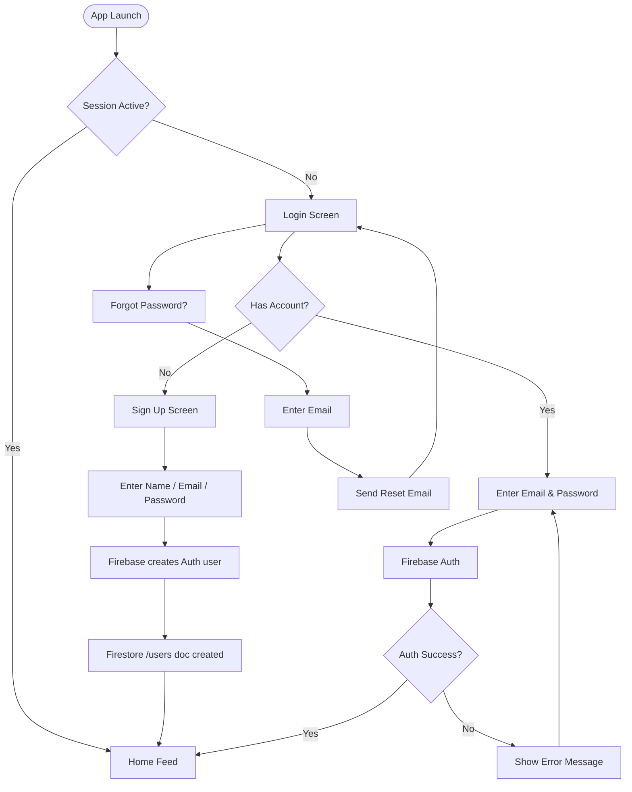
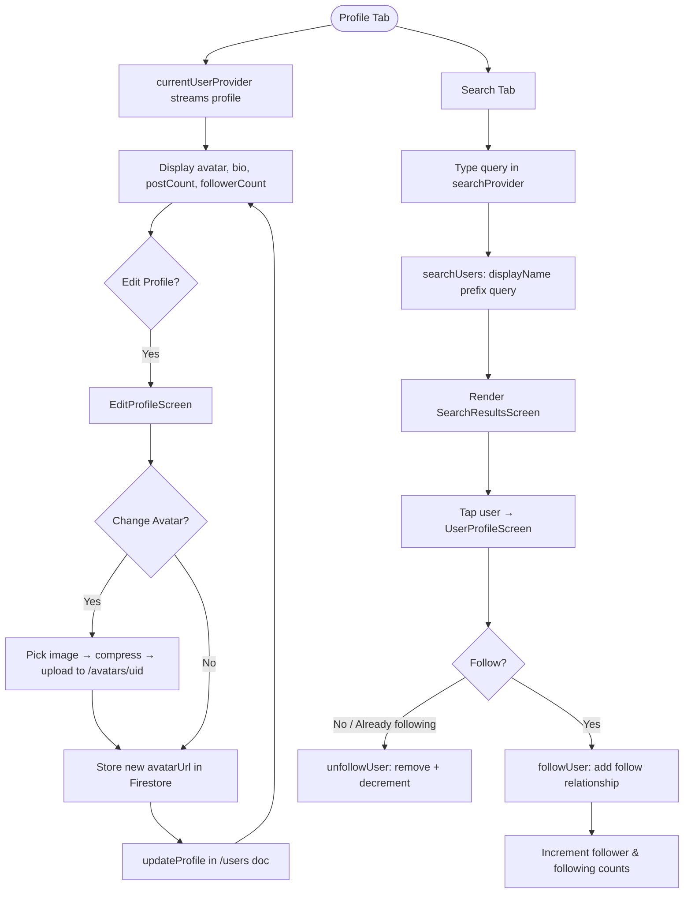

<div align="center">


### Social & Community Mobile Application

*Sprint #2 — Flutter & Firebase Project*
*Version 1.0 | March 9, 2026*

[Features](#-features) · [Architecture](#-architecture) · [Project Structure](#-project-structure) · [Getting Started](#-getting-started) · [Data Models](#-data-models) · [Services](#-service-layer) · [State Management](#-state-management) · [Security](#-security) · [Testing](#-testing) · [Team](#-team)

</div>

---

## Overview

**NanheNest** is a cross-platform social and community mobile application built with **Flutter** and **Firebase**. It enables users to create profiles, share posts with media, interact through likes and comments, engage in real-time messaging, discover nearby community events via maps, and receive push notifications for relevant activity.

NanheNest targets **Android** (primary) and **iOS** (secondary) platforms through Flutter's cross-platform framework with a fully serverless Firebase backend.

---

##  Features

| # | Feature | Description |
|---|---------|-------------|
| F1 | **User Authentication** | Email/password sign-up, login, logout with persistent sessions |
| F2 | **User Profiles** | Editable profiles with avatar, bio, and activity stats |
| F3 | **Post Feed** | Create, view, edit, delete posts with text and media attachments |
| F4 | **Social Interactions** | Like, comment, and share posts with real-time counters |
| F5 | **Real-Time Messaging** | One-on-one chat with live sync via Firestore snapshots |
| F6 | **Community Events Map** | Google Maps integration showing events and user locations |
| F7 | **Push Notifications** | FCM-powered alerts for likes, comments, messages, and events |
| F8 | **Media Management** | Image upload, compression, and CDN delivery via Firebase Storage |
| F9 | **Dark Mode & Theming** | Dynamic theme switching with Material 3 color system |
| F10 | **Search & Discovery** | Search users, posts, and community events with filters |

---

##  Architecture

NanheNest follows a **three-tier client-serverless architecture** combined with the **MVVM pattern** on the client side.

```
┌─────────────────────────────────────────────────┐
│              CLIENT TIER                        │
│   Flutter Mobile App (Android / iOS)            │
│   Screens │ Widgets │ Navigation │ Riverpod     │
└────────────────────┬────────────────────────────┘
                     │
┌────────────────────▼────────────────────────────┐
│              SERVICE TIER                       │
│           Firebase SDK Layer                    │
│   Auth │ Firestore │ Storage │ FCM │ Functions  │
└────────────────────┬────────────────────────────┘
                     │
┌────────────────────▼────────────────────────────┐
│           EXTERNAL SERVICES                     │
│   Google Maps SDK │ Cloud Functions Runtime     │
└─────────────────────────────────────────────────┘
```

### Technology Stack

| Category | Technology | Purpose |
|----------|------------|---------|
| Language | Dart 3.x | Primary programming language |
| Framework | Flutter 3.x | Cross-platform mobile UI framework |
| Authentication | Firebase Auth | Email/password, session management |
| Database | Cloud Firestore | NoSQL real-time document database |
| File Storage | Firebase Storage | Media files (images, avatars) |
| Serverless | Cloud Functions | Event-driven backend logic (Node.js 18) |
| Notifications | Firebase Cloud Messaging | Push notification delivery |
| Maps | Google Maps SDK | Map rendering, markers, geolocation |
| State Management | Riverpod 2.x | Reactive, testable state management |
| Design | Figma | UI/UX design and prototyping |
| Version Control | Git + GitHub | Source code management |
| CI/CD | GitHub Actions | Automated build, test, and deployment |

---

## Project Structure

```
nanhenest/
├── lib/
│   ├── main.dart              # App entry point, theme config, route setup
│   ├── core/
│   │   └── config/            # Firebase bootstrap and initialization wrapper
│   ├── config/                # App config, constants, theme data
│   ├── models/                # Data model classes (User, Post, Event, etc.)
│   ├── providers/             # Riverpod providers for state management
│   ├── services/              # Firebase service wrappers
│   │   ├── auth_service.dart
│   │   ├── user_service.dart
│   │   ├── post_service.dart
│   │   ├── chat_service.dart
│   │   ├── event_service.dart
│   │   ├── storage_service.dart
│   │   └── notification_service.dart
│   ├── screens/               # Screen-level widgets organized by feature
│   │   ├── auth/              # Login, SignUp, ForgotPassword
│   │   ├── feed/              # FeedScreen, PostDetailScreen, CreatePostScreen
│   │   ├── chat/              # ChatListScreen, ChatRoomScreen
│   │   ├── map/               # MapScreen, EventDetailScreen, CreateEventScreen
│   │   ├── search/            # SearchScreen, SearchResultsScreen
│   │   └── profile/           # MyProfileScreen, EditProfileScreen, SettingsScreen
│   ├── widgets/               # Reusable UI components
│   ├── utils/                 # Helpers, formatters, validators
│   └── routes/                # Route definitions and navigation logic
├── functions/                 # Cloud Functions source (Node.js/TypeScript)
├── test/                      # Unit and widget tests
├── android/                   # Android-specific configuration
├── ios/                       # iOS-specific configuration
├── pubspec.yaml               # Flutter dependencies
└── README.md
```

---

## Getting Started

### Prerequisites

- [Flutter SDK](https://flutter.dev/docs/get-started/install) (3.x or higher)
- [Dart SDK](https://dart.dev/get-dart) (3.x or higher)
- [Firebase CLI](https://firebase.google.com/docs/cli)
- [Node.js](https://nodejs.org/) 18+ (for Cloud Functions)
- [Android Studio](https://developer.android.com/studio) or [VS Code](https://code.visualstudio.com/)
- A Google Maps API key

### 1. Clone the Repository

```bash
git clone https://github.com/kalviumcommunity/S64-Mar26-Team01-FFDP.git
cd S64-Mar26-Team01-FFDP
```

### 2. Firebase Setup

1. Create a new Firebase project at [console.firebase.google.com](https://console.firebase.google.com)
2. Enable the following services:
   - Authentication (Email/Password provider)
   - Cloud Firestore
   - Firebase Storage
   - Cloud Messaging (FCM)
   - Cloud Functions
3. Download `google-services.json` (Android) and `GoogleService-Info.plist` (iOS)
4. Place them in the appropriate directories:
   - `android/app/google-services.json`
   - `ios/Runner/GoogleService-Info.plist`

### 3. Configure FlutterFire

```bash
dart pub global activate flutterfire_cli
flutterfire configure
```

*Note: The project uses a custom `FirebaseBootstrap` class (`lib/core/config/firebase_bootstrap.dart`) to robustly initialize Firebase across all platforms (including explicit iOS and macOS support) and provides an integrated fallback UI for startup errors.*

### 4. Add Google Maps API Key

**Android** — `android/app/src/main/AndroidManifest.xml`:
```xml
<meta-data
    android:name="com.google.android.geo.API_KEY"
    android:value="YOUR_GOOGLE_MAPS_API_KEY"/>
```

**iOS** — `ios/Runner/AppDelegate.swift`:
```swift
GMSServices.provideAPIKey("YOUR_GOOGLE_MAPS_API_KEY")
```

### 5. Install Dependencies

```bash
flutter pub get
```

### 6. Deploy Firestore Security Rules

```bash
firebase deploy --only firestore:rules
firebase deploy --only storage
```

### 7. Deploy Cloud Functions

```bash
cd functions
npm install
cd ..
firebase deploy --only functions
```

### 8. Run the Application

```bash
# Run on connected device or emulator
flutter run

# Run in release mode
flutter run --release
```

---

##  Dependencies

```yaml
dependencies:
  firebase_core: ^2.x          # Firebase initialization
  firebase_auth: ^4.x          # Authentication
  cloud_firestore: ^4.x        # Firestore database
  firebase_storage: ^11.x      # File storage
  firebase_messaging: ^14.x    # Push notifications
  flutter_riverpod: ^2.x       # State management
  google_maps_flutter: ^2.x    # Google Maps integration
  geolocator: ^10.x            # Location access
  image_picker: ^1.x           # Camera/gallery image selection
  flutter_image_compress: ^2.x # Image compression
  flutter_local_notifications: ^16.x # Foreground notifications
  cached_network_image: ^3.x   # Image caching
  intl: ^0.18.x                # Date/time formatting
  go_router: ^12.x             # Declarative routing
```

---

##  Data Models

### UserModel

```dart
class UserModel {
  final String uid;
  final String email;
  final String displayName;
  final String avatarUrl;
  final String bio;
  final int postCount;
  final int followerCount;
  final int followingCount;
  final String fcmToken;
  final DateTime createdAt;
  final DateTime lastActive;
}
```

### PostModel

```dart
class PostModel {
  final String postId;
  final String authorUid;
  final String authorName;
  final String authorAvatar;
  final String content;
  final String? imageUrl;
  final int likeCount;
  final int commentCount;
  final DateTime createdAt;
  final DateTime updatedAt;
}
```

### MessageModel

```dart
class MessageModel {
  final String messageId;
  final String senderUid;
  final String text;
  final String type;    // 'text' | 'image'
  final DateTime createdAt;
  final List<String> readBy;
}
```

### EventModel

```dart
class EventModel {
  final String eventId;
  final String creatorUid;
  final String title;
  final String description;
  final GeoPoint location;
  final String address;
  final DateTime dateTime;
  final String? imageUrl;
  final List<String> attendees;
  final DateTime createdAt;
}
```

---

## Service Layer

Each service class encapsulates all Firebase interactions for a specific domain and is provided as a singleton via Riverpod.

### AuthService (`lib/services/auth_service.dart`)

| Method | Return Type | Description |
|--------|-------------|-------------|
| `signUp(email, password, name)` | `Future<UserCredential>` | Register new user + create `/users` doc |
| `signIn(email, password)` | `Future<UserCredential>` | Authenticate existing user |
| `signOut()` | `Future<void>` | Sign out + clear local state |
| `resetPassword(email)` | `Future<void>` | Send password reset email |
| `authStateChanges()` | `Stream<User?>` | Stream of auth state for session persistence |
| `updateFcmToken(token)` | `Future<void>` | Store FCM token in user document |

### PostService (`lib/services/post_service.dart`)

| Method | Return Type | Description |
|--------|-------------|-------------|
| `createPost(post, imageFile?)` | `Future<String>` | Create post + optional image upload |
| `getFeedStream(limit)` | `Stream<List<PostModel>>` | Real-time feed ordered by `createdAt` desc |
| `toggleLike(postId, uid)` | `Future<void>` | Like/unlike with Firestore transaction |
| `addComment(postId, comment)` | `Future<void>` | Add comment + increment counter |
| `loadMorePosts(lastDoc, limit)` | `Future<List<PostModel>>` | Pagination with `startAfter` cursor |
| `getUserPosts(uid)` | `Stream<List<PostModel>>` | Posts by a specific user |

### ChatService (`lib/services/chat_service.dart`)

| Method | Return Type | Description |
|--------|-------------|-------------|
| `getOrCreateChat(uid1, uid2)` | `Future<String>` | Get existing or create new chat room |
| `sendMessage(chatId, msg)` | `Future<void>` | Send message + update `lastMessage` |
| `getMessages(chatId)` | `Stream<List<MessageModel>>` | Real-time message stream |
| `getUserChats(uid)` | `Stream<List<ChatModel>>` | All chats sorted by recent |
| `markAsRead(chatId, uid)` | `Future<void>` | Reset unread counter for user |

### EventService (`lib/services/event_service.dart`)

| Method | Return Type | Description |
|--------|-------------|-------------|
| `createEvent(event, imageFile?)` | `Future<String>` | Create event + optional image |
| `getEvents()` | `Stream<List<EventModel>>` | All upcoming events stream |
| `toggleAttendance(eventId, uid)` | `Future<void>` | RSVP toggle |
| `getNearbyEvents(center, radius)` | `Future<List<EventModel>>` | Filter by distance from a point |

---

## State Management

NanheNest uses **Riverpod 2.x** for reactive, testable state management.

### Local State Management with setState()

For simple, local UI state that doesn't need to be shared across the app, we use Flutter's built-in `setState()` method. This is demonstrated in our `StateManagementDemo` widget:

#### Key Concepts:
- **StatefulWidget**: Widgets that can change dynamically based on user interactions
- **setState()**: Notifies Flutter that the widget's internal state has changed and needs to be rebuilt
- **Local vs Global State**: Use `setState()` for widget-specific state, Riverpod for app-wide state

#### Implementation Example:
```dart
class StateManagementDemo extends StatefulWidget {
  @override
  _StateManagementDemoState createState() => _StateManagementDemoState();
}

class _StateManagementDemoState extends State<StateManagementDemo> {
  int _counter = 0;

  void _incrementCounter() {
    setState(() {
      _counter++;
    });
  }

  @override
  Widget build(BuildContext context) {
    return Scaffold(
      appBar: AppBar(
        title: Text('State Management Demo'),
        backgroundColor: _counter >= 5 ? Colors.green : Colors.blue,
      ),
      body: Container(
        color: _counter >= 10 ? Colors.amber[100] : Colors.white,
        child: Center(
          child: Column(
            mainAxisAlignment: MainAxisAlignment.center,
            children: [
              Text('Button pressed:'),
              Text('$_counter times', 
                style: TextStyle(fontSize: 24, fontWeight: FontWeight.bold)),
              ElevatedButton(
                onPressed: _incrementCounter,
                child: Text('Increment'),
              ),
            ],
          ),
        ),
      ),
    );
  }
}
```

#### Conditional UI Updates:
The demo showcases dynamic UI changes based on state:
- **App Bar Color**: Changes from blue to green when counter ≥ 5
- **Background Color**: Changes to amber when counter ≥ 10
- **Text Color**: Changes to red when milestone is reached
- **Celebration Message**: Appears when counter ≥ 10

#### Best Practices:
1. **Always wrap state changes in setState()**: Direct variable updates won't trigger UI rebuilds
2. **Avoid setState() in build()**: This creates infinite rebuild loops
3. **Use local state for widget-specific data**: Counter values, form inputs, toggle states
4. **Keep setState() calls minimal**: Only update the specific data that changed

#### Common Mistakes to Avoid:
- Updating state without setState(): `counter++;` (won't rebuild UI)
- Calling setState() in build() method (causes infinite loops)
- Using setState() for app-wide state (use Riverpod instead)

| Provider | Type | Purpose |
|----------|------|---------|
| `authProvider` | `StreamProvider<User?>` | Auth state stream for route guards |
| `currentUserProvider` | `StreamProvider<UserModel>` | Current user profile data |
| `feedProvider` | `StreamProvider<List<PostModel>>` | Main feed with real-time updates |
| `postDetailProvider` | `FamilyProvider(postId)` | Individual post with comments |
| `chatListProvider` | `StreamProvider<List<ChatModel>>` | User's chat rooms sorted by recent |
| `messagesProvider` | `FamilyProvider(chatId)` | Messages for a specific chat |
| `eventsProvider` | `StreamProvider<List<EventModel>>` | All community events |
| `themeProvider` | `StateNotifierProvider` | Light/dark mode state |
| `searchProvider` | `StateNotifierProvider` | Search query and results |

### Auth State Flow

```dart
class AuthNotifier extends StateNotifier<AsyncValue<User?>> {
  final AuthService _authService;

  AuthNotifier(this._authService) : super(const AsyncLoading()) {
    _authService.authStateChanges().listen((user) {
      state = AsyncData(user);
    });
  }

  Future<void> signIn(String email, String password) async {
    state = const AsyncLoading();
    try {
      await _authService.signIn(email, password);
    } catch (e) {
      state = AsyncError(e, StackTrace.current);
    }
  }
}
```

---

## User Flows

### 1. Onboarding & Authentication



---

### 2. Post Feed & Social Interactions


---

### 3. Real-Time Messaging


---

### 4. Community Events & Map

```mermaid
flowchart TD
    A([Map Tab]) --> B[Request Location Permission]
    B --> C{Permission Granted?}
    C -- No --> D[Show permission dialog]
    D --> B
    C -- Yes --> E[Load Google Maps with user location]
    E --> F[eventsProvider streams /events]
    F --> G[Place custom markers on map]
    G --> H{User Action}
    H -- Tap Marker --> I[Event Info Bottom Sheet]
    I --> J{RSVP?}
    J -- Yes --> K[toggleAttendance: add uid to attendees]
    K --> L[Update Firestore /events doc]
    J -- No --> I
    H -- Create Event --> M[CreateEventScreen]
    M --> N[Fill title / description / dateTime]
    N --> O[Pick location on map]
    O --> P{Attach Banner Image?}
    P -- Yes --> Q[Upload to /events/{eventId} in Storage]
    P -- No --> R[Save GeoPoint + all fields to Firestore]
    Q --> R
    R --> S[Cloud Fn: onNewEvent → notify nearby users]
    S --> E
```

---

### 5. User Profile & Search



---

### 6. Push Notification Flow

```mermaid
flowchart TD
    A([App Start]) --> B[NotificationService.initialize]
    B --> C[Get FCM device token]
    C --> D[Store token in /users/{uid}.fcmToken]
    D --> E{App State}
    E -- Foreground --> F[flutter_local_notifications shows banner]
    E -- Background / Killed --> G[FCM delivers system notification]
    F --> H{User taps notification?}
    G --> H
    H -- like / comment --> I[Navigate to PostDetailScreen]
    H -- message --> J[Navigate to ChatRoomScreen]
    H -- event --> K[Navigate to EventDetailScreen]
```

---

## Navigation Structure

The app uses a `BottomNavigationBar` with **5 main tabs**, each with its own Navigator stack for independent navigation history.

| # | Tab | Root Screen | Child Screens |
|---|-----|-------------|---------------|
| 1 | Home | `FeedScreen` | `PostDetailScreen`, `CreatePostScreen`, `UserProfileScreen` |
| 2 | Search | `SearchScreen` | `SearchResultsScreen`, `UserProfileScreen` |
| 3 | Map | `MapScreen` | `EventDetailScreen`, `CreateEventScreen` |
| 4 | Chat | `ChatListScreen` | `ChatRoomScreen` |
| 5 | Profile | `MyProfileScreen` | `EditProfileScreen`, `SettingsScreen` |

---

## Firestore Database Schema

### `/users` Collection
```
users/{uid}
├── email         : String
├── displayName   : String
├── avatarUrl     : String
├── bio           : String (max 160 chars)
├── postCount     : Number
├── followerCount : Number
├── followingCount: Number
├── fcmToken      : String
├── createdAt     : Timestamp
└── lastActive    : Timestamp
```

### `/posts` Collection
```
posts/{postId}
├── authorUid     : String
├── authorName    : String  (denormalized)
├── authorAvatar  : String  (denormalized)
├── content       : String
├── imageUrl      : String?
├── likeCount     : Number
├── commentCount  : Number
├── createdAt     : Timestamp
├── updatedAt     : Timestamp
├── comments/{commentId}
│   ├── authorUid : String
│   ├── authorName: String
│   ├── text      : String
│   └── createdAt : Timestamp
└── likes/{uid}
    └── createdAt : Timestamp
```

### `/chats` Collection
```
chats/{chatId}           <- chatId = sorted "uid1_uid2"
├── participants   : Array<String>
├── lastMessage    : String
├── lastMessageAt  : Timestamp
├── unreadCount    : Map<String, Number>
└── messages/{messageId}
    ├── senderUid  : String
    ├── text       : String
    ├── type       : String ('text' | 'image')
    ├── createdAt  : Timestamp
    └── readBy     : Array<String>
```

### `/events` Collection
```
events/{eventId}
├── creatorUid    : String
├── title         : String
├── description   : String
├── location      : GeoPoint
├── address       : String
├── dateTime      : Timestamp
├── imageUrl      : String?
├── attendees     : Array<String>
└── createdAt     : Timestamp
```

### Firebase Storage Structure

| Path | Purpose |
|------|---------|
| `/avatars/{uid}/profile.jpg` | User profile images |
| `/posts/{postId}/{filename}` | Post image attachments |
| `/events/{eventId}/{filename}` | Event banner images |
| `/chat_media/{chatId}/{filename}` | Chat shared images |

---

## Cloud Functions

Runtime: **Node.js 18 (TypeScript)**

| Function | Trigger | Description |
|----------|---------|-------------|
| `onNewLike` | Firestore `onCreate` | Sends push notification to post author on new like |
| `onNewComment` | Firestore `onCreate` | Sends push notification to post author on new comment |
| `onNewMessage` | Firestore `onCreate` | Sends push to recipient, updates `unreadCount` |
| `onUserDelete` | Auth `onDelete` | Cleans up user data: posts, chats, event attendee lists |
| `onNewEvent` | Firestore `onCreate` | Notifies nearby users via FCM |
| `cleanupExpiredEvents` | Scheduled (daily) | Deletes events with past `dateTime` |

---

## Security

### Firestore Security Rules

| Collection | Read | Write |
|------------|------|-------|
| `/users/{uid}` | Any authenticated user | Document owner only |
| `/posts/{postId}` | Any authenticated user | Create: authenticated; Update/Delete: author only |
| `/posts/{id}/comments` | Any authenticated user | Create: authenticated; Delete: comment author |
| `/chats/{chatId}` | Participants only | Participants only |
| `/events/{eventId}` | Any authenticated user | Create: authenticated; Update/Delete: creator |

### Firebase Storage Security Rules

- **Avatars**: Max 5 MB, `image/*` type only, owner-write restricted
- **Post images**: Max 10 MB, `image/*` type only, any authenticated user
- **Event images**: Max 10 MB, `image/*` type only, any authenticated user
- **Chat media**: Max 10 MB, any authenticated user

---

## Error Handling

| Error Type | Handling | User Experience |
|------------|----------|-----------------|
| Network Error | Catch `SocketException` | `ErrorRetryWidget` with offline indicator |
| Auth Error | Map `FirebaseAuthException` codes | Specific messages (e.g., "Wrong password") |
| Firestore Error | Catch `FirebaseException` | SnackBar with error + retry option |
| Permission Error | Catch `PlatformException` | Dialog explaining why permission is needed |
| Image Upload Error | Retry with exponential backoff | Progress indicator + failure message |
| Empty State | Check list length == 0 | `EmptyStateWidget` with helpful message |
| Loading State | `AsyncValue.loading` | Shimmer placeholder or circular indicator |

---

## 🧩 Reusable Widgets

| Widget | Props | Description |
|--------|-------|-------------|
| `PostCard` | `PostModel, onLike, onComment, onTap` | Feed item card with all post interactions |
| `UserAvatar` | `String url, double size, VoidCallback? onTap` | Circular avatar with fallback initials |
| `MessageBubble` | `MessageModel, bool isMine` | Chat bubble with timestamp |
| `EventCard` | `EventModel, VoidCallback onTap` | Event summary card for lists |
| `CustomTextField` | `controller, label, validator, obscure` | Styled text input with validation |
| `PrimaryButton` | `String text, VoidCallback onPressed, bool loading` | Themed action button with loading spinner |
| `EmptyStateWidget` | `String icon, String message` | Placeholder for empty lists |
| `LoadingOverlay` | `bool isLoading, Widget child` | Full-screen loading indicator overlay |
| `ErrorRetryWidget` | `String message, VoidCallback onRetry` | Error display with retry button |

---

## 🧪 Testing

### Unit Tests
- Data model serialization/deserialization (`fromFirestore`, `toMap`)
- Service method logic with mocked Firebase instances
- Provider state transitions and error handling
- Validator functions (email, password, post content)

### Widget Tests
- `PostCard` renders correctly with sample data
- Form validation displays error messages
- Navigation triggers on button taps
- Empty state and loading state rendering

### Integration Tests
- Full auth flow: sign-up → login → logout
- Post CRUD: create, read, update, delete
- Chat: send message, receive message
- Event: create, RSVP, view on map

```bash
# Run unit and widget tests
flutter test

# Run integration tests
flutter test integration_test/
```

---

## Non-Functional Requirements

| Category | Requirement |
|----------|-------------|
| **Cold Start** | < 3 seconds on mid-range devices |
| **Feed Load** | < 1.5 seconds for initial 20 posts |
| **Messaging Latency** | < 500ms end-to-end |
| **Image Upload** | Compressed to < 500KB before upload |
| **Uptime** | 99.95% (Firebase SLA) |
| **Offline Mode** | Firestore cached data accessible without network |
| **Scalability** | Firestore + Cloud Functions auto-scale serverlessly |

---

## CI/CD Pipeline

```
Push / PR to main
       │
       ▼
GitHub Actions
   ├── flutter analyze   (lint & static analysis)
   ├── flutter test      (unit + widget tests)
   └── flutter build apk (APK artifact)
```

**Deployment:**
- Staging Firebase project for pre-production testing
- Release builds: APK and App Bundle generation
- Play Store deployment via Fastlane or manual upload

---

## Concept 2: Firebase Authentication & Storage Implementation

This section documents the implementation of **Concept 2**, which focuses on integrating Firebase Authentication and Firebase Storage into NanheNest.

### Firebase Authentication (`lib/services/auth_service.dart`)

The `AuthService` class manages all authentication operations:

| Method | Return Type | Description |
| ------ | ----------- | ----------- |
| `signUp(email, password, name)` | `Future<UserCredential>` | Register new user + create `/users` doc in Firestore |
| `signIn(email, password)` | `Future<UserCredential>` | Authenticate existing user |
| `signOut()` | `Future<void>` | Sign out + clear local session |
| `resetPassword(email)` | `Future<void>` | Send password reset email |
| `authStateChanges()` | `Stream<User?>` | Stream of auth state for session persistence |
| `updateFcmToken(token)` | `Future<void>` | Store FCM token in user document |
| `updateLastActive()` | `Future<void>` | Update user's last active timestamp |
| `currentUser` | `User?` | Get currently authenticated user |

**Features:**

- Email/password authentication with Firebase Auth
- Automatic user document creation in Firestore upon signup
- Comprehensive error handling with user-friendly messages
- Real-time auth state listening for route guards
- Session persistence across app restarts

### Firebase Storage (`lib/services/storage_service.dart`)

The `StorageService` class handles all file upload and download operations:

| Method | Return Type | Description |
| ------ | ----------- | ----------- |
| `uploadUserAvatar(userId, imageFile)` | `Future<String>` | Upload + compress user profile image |
| `uploadPostImage(postId, imageFile)` | `Future<String>` | Upload post image with compression |
| `uploadEventImage(eventId, imageFile)` | `Future<String>` | Upload event banner image |
| `uploadChatMedia(chatId, mediaFile)` | `Future<String>` | Upload media shared in chats |
| `deleteFile(filePath)` | `Future<void>` | Delete file from Firebase Storage |
| `deleteUserAvatar(userId)` | `Future<void>` | Delete user avatar |
| `getDownloadURL(filePath)` | `Future<String>` | Get public download URL for a file |

**Features:**

- Automatic image compression (80% quality, min 1024x1024)
- Organized folder structure for different content types
- Metadata tagging (content-type, timestamps)
- Error recovery with fallback to original file
- File deletion support with automatic error handling

### Data Models

**UserModel** (`lib/models/user_model.dart`):
- Stores user profile data (uid, email, displayName, avatar, bio)
- Firestore serialization/deserialization methods
- CopyWith pattern for immutability
- Activity tracking (postCount, followerCount, followingCount)

**BookingModel** (`lib/models/booking_model.dart`):
- Represents community events/bookings
- GeoPoint location support for map integration
- Attendee list management
- Helper methods: `userIsAttending()`, `isUpcoming()`

### Firebase Security Rules

#### Firestore Rules

```firestore
rules_version = '2';
service cloud.firestore {
  match /databases/{database}/documents {
    // Users collection - owner write only
    match /users/{uid} {
      allow read: if request.auth != null;
      allow write: if request.auth.uid == uid;
    }

    // Posts collection - public read, authenticated write
    match /posts/{postId} {
      allow read: if request.auth != null;
      allow create: if request.auth != null;
      allow update, delete: if request.auth.uid == resource.data.authorUid;

      // Comments subcollection
      match /comments/{commentId} {
        allow read: if request.auth != null;
        allow create: if request.auth != null;
        allow delete: if request.auth.uid == resource.data.authorUid;
      }
    }

    // Events collection - public read, authenticated write
    match /events/{eventId} {
      allow read: if request.auth != null;
      allow create: if request.auth != null;
      allow update, delete: if request.auth.uid == resource.data.creatorUid;
    }
  }
}
```

#### Storage Rules

```firestore
rules_version = '2';
service firebase.storage {
  match /b/{bucket}/o {
    // Avatars - max 5MB, owner write only
    match /avatars/{userId}/{allPaths=**} {
      allow read: if request.auth != null;
      allow write: if request.auth.uid == userId &&
                      request.resource.size < 5 * 1024 * 1024 &&
                      request.resource.contentType.matches('image/.*');
    }

    // Posts - max 10MB, authenticated users
    match /posts/{postId}/{allPaths=**} {
      allow read: if request.auth != null;
      allow write: if request.auth != null &&
                      request.resource.size < 10 * 1024 * 1024 &&
                      request.resource.contentType.matches('image/.*');
    }

    // Events - max 10MB, authenticated users
    match /events/{eventId}/{allPaths=**} {
      allow read: if request.auth != null;
      allow write: if request.auth != null &&
                      request.resource.size < 10 * 1024 * 1024 &&
                      request.resource.contentType.matches('image/.*');
    }

    // Chat media - max 10MB, authenticated users
    match /chat_media/{chatId}/{allPaths=**} {
      allow read: if request.auth != null;
      allow write: if request.auth != null &&
                      request.resource.size < 10 * 1024 * 1024;
    }
  }
}
```

### Firestore Collection Schema

#### `/users` Collection
```
users/{uid}
├── email         : String
├── displayName   : String
├── avatarUrl     : String (URL from Storage)
├── bio           : String
├── postCount     : Number
├── followerCount : Number
├── followingCount: Number
├── fcmToken      : String
├── createdAt     : Timestamp
└── lastActive    : Timestamp
```

#### `/events` Collection
```
events/{eventId}
├── creatorUid    : String
├── title         : String
├── description   : String
├── location      : GeoPoint (latitude, longitude)
├── address       : String
├── eventDateTime : Timestamp
├── imageUrl      : String? (URL from Storage)
├── attendees     : Array<String> (list of user UIDs)
├── isActive      : Boolean
└── createdAt     : Timestamp
```

### Setup Instructions

1. **Add Firebase to pubspec.yaml:**

   ```yaml
   dependencies:
     firebase_core: ^2.24.0
     firebase_auth: ^4.11.0
     firebase_storage: ^11.5.0
     cloud_firestore: ^4.14.0
   ```

2. **Configure Firebase:**

   ```bash
   flutterfire configure
   ```

3. **Set up Security Rules:**

   Deploy Firestore and Storage rules via Firebase Console or CLI:

   ```bash
   firebase deploy --only firestore:rules
   firebase deploy --only storage
   ```

4. **Initialize in main.dart:**

   ```dart
   await Firebase.initializeApp(
     options: DefaultFirebaseOptions.currentPlatform,
   );
   ```

### Error Handling

Authentication errors are mapped to user-friendly messages:

- `weak-password` → "The password provided is too weak."
- `email-already-in-use` → "An account already exists for that email."
- `invalid-email` → "The email address is not valid."
- `user-not-found` → "No user found for that email."
- `wrong-password` → "Wrong password provided."

Storage errors include:

- Permission denied → Check Security Rules
- Quota exceeded → User storage limit reached
- File not found → Graceful retry or placeholder

---

## Concept 3.10: Firebase Authentication & Firestore Integration

This section documents the implementation of **Concept 3.10**, which provides complete Firebase Authentication and Firestore CRUD operations for the NanheNest application.

### Overview

Concept 3.10 extends the Firebase integration with:
- **Complete Auth Flow**: Sign-up, login, logout, and password reset functionality
- **Real-time UI Navigation**: Auth state-based routing with `StreamBuilder`
- **Firestore CRUD Operations**: Create, read, update, and delete posts and user data
- **Real-time Data Sync**: Firestore `StreamBuilder` for live feed updates
- **Production-Ready Screens**: Login, signup, and dashboard screens with full validation

### Authentication Flow

#### AuthService (`lib/services/auth_service.dart`)

Complete authentication service with:
- User registration with automatic Firestore document creation
- Email/password login with error handling
- Logout functionality
- Password reset via email
- FCM token management
- Last active timestamp tracking
- Auth state stream for session persistence

```dart
// Sign up example
await authService.signUp(
  email: 'user@example.com',
  password: 'SecurePass123',
  displayName: 'John Doe',
);

// Sign in example
await authService.signIn(
  email: 'user@example.com',
  password: 'SecurePass123',
);

// Listen to auth state
authService.authStateChanges().listen((user) {
  if (user != null) {
    print('User logged in: ${user.email}');
  } else {
    print('User logged out');
  }
});
```

### Firestore Operations

#### FirestoreService (`lib/services/firestore_service.dart`)

Comprehensive CRUD service with:

| Operation | Method | Returns | Description |
|-----------|--------|---------|-------------|
| **Create** | `createPost(uid, content, displayName)` | `Future<String>` | Create post + return post ID |
| **Read** | `getPostsStream()` | `Stream<List<Map>>` | Real-time feed of all posts |
| **Read** | `getUserPostsStream(uid)` | `Stream<List<Map>>` | Real-time posts by specific user |
| **Update** | `updatePost(postId, content)` | `Future<void>` | Edit post content |
| **Delete** | `deletePost(postId)` | `Future<void>` | Remove post from Firestore |
| **Interaction** | `likePost(postId)` | `Future<void>` | Increment like count |
| **Interaction** | `unlikePost(postId)` | `Future<void>` | Decrement like count |
| **User** | `updateUserProfile(uid, ...)` | `Future<void>` | Update profile fields |
| **User** | `getUserDocument(uid)` | `Future<UserModel?>` | Fetch single user profile |
| **User** | `getUserStream(uid)` | `Stream<UserModel?>` | Real-time user data |

```dart
// Create a post
final postId = await firestoreService.createPost(
  uid: 'user123',
  content: 'Hello NanheNest!',
  displayName: 'John Doe',
);

// Listen to feed in real-time
firestoreService.getPostsStream().listen((posts) {
  setState(() => _posts = posts);
});

// Update user profile
await firestoreService.updateUserProfile(
  uid: 'user123',
  displayName: 'John Updated',
  bio: 'A Flutter enthusiast',
);
```

### UI Components

#### Login Screen (`lib/screens/auth/login_screen.dart`)

Features:
- Email and password input fields with validation
- Password visibility toggle
- "Forgot Password" functionality
- Sign-up navigation
- Loading state during authentication
- Error handling with SnackBar feedback

```dart
LoginScreen(
  onSignUpTap: () => _toggleAuthScreen(),
)
```

#### Sign-Up Screen (`lib/screens/auth/signup_screen.dart`)

Features:
- Full name, email, password, confirm password fields
- Form validation
- Terms and conditions checkbox
- Password matching validation
- Account creation with automatic Firestore user doc
- Error messages for each validation rule

```dart
SignUpScreen(
  onLoginTap: () => _toggleAuthScreen(),
)
```

#### Dashboard Screen (`lib/screens/home/dashboard_screen.dart`)

Features:
- User profile section with email and display name
- Create post form with text input
- Real-time feed with StreamBuilder
- Post display with creator, timestamp, content, and stats
- Like and comment counters
- Delete post functionality (owner only)
- Logout button
- Empty state placeholder

```dart
// Real-time feed updates
StreamBuilder<List<Map<String, dynamic>>>(
  stream: _firestoreService.getPostsStream(),
  builder: (context, snapshot) {
    if (snapshot.hasData) {
      return ListView(children: buildPostCards(snapshot.data!));
    }
    return CircularProgressIndicator();
  },
)
```

### Authentication State Management

#### AuthGate Widget (`lib/main.dart`)

Handles app-level routing based on authentication state:

```dart
StreamBuilder<User?>(
  stream: authService.authStateChanges(),
  builder: (context, snapshot) {
    // Loading state
    if (snapshot.connectionState == ConnectionState.waiting) {
      return Scaffold(
        body: Center(child: CircularProgressIndicator()),
      );
    }

    // Authenticated: show dashboard
    if (snapshot.hasData) {
      return DashboardScreen();
    }

    // Not authenticated: show auth screens
    return LoginScreen(onSignUpTap: toggleScreen);
  },
)
```

### Firestore Data Structure for 3.10

#### Posts Collection
```
posts/{postId}
├── uid             : String (creator's user ID)
├── displayName     : String (creator's name)
├── content         : String (post text)
├── imageUrl        : String? (optional image)
├── likes           : Number (like count)
├── comments        : Number (comment count)
├── createdAt       : Timestamp
└── updatedAt       : Timestamp
```

#### Users Subcollection (from AuthService)
```
users/{uid}
├── email           : String
├── displayName     : String
├── avatarUrl       : String
├── bio             : String
├── postCount       : Number
├── followerCount   : Number
├── followingCount  : Number
├── fcmToken        : String
├── createdAt       : Timestamp
└── lastActive      : Timestamp
```

### Key Features Implemented

1. **Email/Password Authentication**
   - Sign up with validation
   - Login with error handling
   - Password reset email
   - Logout

2. **Real-time Data Sync**
   - Posts feed updates in real-time
   - User profile updates instantly
   - Comment and like counters sync

3. **Post Management**
   - Create posts with text content
   - View feed from all users
   - Delete own posts
   - Like/unlike functionality

4. **User Profile**
   - View logged-in user info
   - Update profile information
   - Last active timestamp tracking

5. **Error Handling**
   - Form validation feedback
   - Firebase exception mapping
   - User-friendly error messages
   - Loading states during operations

### Setup for Concept 3.10

1. **Ensure Firebase is initialized** in `main.dart`:
   ```dart
   await Firebase.initializeApp(
     options: DefaultFirebaseOptions.currentPlatform,
   );
   ```

2. **Deploy Firestore Security Rules**:
   ```bash
   firebase deploy --only firestore:rules
   ```

3. **Enable Email/Password Auth** in Firebase Console:
   - Authentication > Sign-in method > Email/Password (enable)

4. **Create Firestore Collections**:
   - Create `users` collection
   - Create `posts` collection

5. **Run the app**:
   ```bash
   flutter run
   ```

### Testing Concept 3.10

**Manual Testing Checklist:**

- [ ] Sign up with new email → User document created in Firestore
- [ ] Log in with valid credentials → Navigate to dashboard
- [ ] Create post → Post appears in feed immediately
- [ ] Refresh app → Feed persists (Firestore cached data)
- [ ] Delete post → Post removed from feed and Firestore
- [ ] Logout → Navigate back to login screen
- [ ] Test password reset → Email received with reset link
- [ ] Try invalid email format → Validation error shown
- [ ] Try weak password → Firebase error message displayed
- [ ] Try duplicate email signup → "Email already in use" error

### Learning Outcomes

By implementing Concept 3.10, you'll understand:

1. **Firebase Authentication**: How to manage user sessions and secure access
2. **Firestore CRUD**: Real-time database operations with Dart models
3. **Stream-based UI**: Using StreamBuilder for reactive data display
4. **Error Handling**: Proper exception handling and user feedback
5. **State Management**: Auth state as the basis for app navigation
6. **Real-time Sync**: How Firestore pushes updates to all connected clients
7. **Security**: Basic Firestore rules to protect user data
8. **UI/UX**: Form validation, loading states, and error messaging

### Challenges & Solutions

**Challenge 1: Real-time updates not showing**
- Solution: Ensure Firestore security rules allow read access for authenticated users

**Challenge 2: Auth state not persisting**
- Solution: Firebase handles persistence automatically; restart app to verify

**Challenge 3: Stream rebuilds too often**
- Solution: Use `distinct()` or `.map()` to filter unnecessary updates

**Challenge 4: Form validation not working**
- Solution: Wrap form in `GlobalKey<FormState>()` and call `validate()` before submit

---

## Concept 3.12: Flutter Project Structure Exploration

This section documents **Concept 3.12**, which explores and documents the Flutter project folder structure, best practices for code organization, and how this structure supports team collaboration and scalability.

### Overview

Understanding the Flutter project structure is crucial for:
- **Code Organization**: Keeping code clean and maintainable
- **Team Collaboration**: Enabling multiple developers to work simultaneously
- **Scalability**: Supporting project growth without architectural changes
- **Performance**: Organizing code for efficient lazy loading and optimization
- **Testing**: Separating business logic for easier unit testing

### Project Structure Breakdown

Our project follows a **feature-based organization** combined with **layered architecture**:

```
S64-Mar26-Team01-FFDP/
│
├── lib/                          # Core application code
│   ├── main.dart                 # App entry point & Firebase initialization
│   ├── firebase_options.dart     # Firebase configuration
│   ├── concept_demo.dart         # Demo/test implementations
│   │
│   ├── screens/                  # UI Screens (organized by feature)
│   │   ├── auth/
│   │   │   ├── login_screen.dart
│   │   │   └── signup_screen.dart
│   │   └── home/
│   │       └── dashboard_screen.dart
│   │
│   ├── services/                 # Business logic & API calls
│   │   ├── auth_service.dart
│   │   ├── firestore_service.dart
│   │   └── storage_service.dart
│   │
│   ├── models/                   # Data models & entities
│   │   ├── user_model.dart
│   │   └── booking_model.dart
│   │
│   └── widgets/                  # Reusable UI components
│       ├── custom_text_field.dart
│       └── primary_button.dart
│
├── android/                      # Android build configuration
├── ios/                          # iOS build configuration
│
├── assets/                       # Static resources (images, fonts)
├── test/                         # Automated tests
│
├── docs/                         # Project documentation
│   ├── setup_guide.md
│   ├── PROJECT_STRUCTURE.md      # Detailed folder breakdown
│   ├── concept1/
│   └── concept3/
│
├── pubspec.yaml                  # Dependencies & asset configuration
└── README.md                     # Main documentation
```

### Folder & File Purposes

| Folder | Purpose | Contains |
|--------|---------|----------|
| **lib/** | Core app code | Screens, services, models, widgets |
| **lib/screens/** | UI screens | Login, signup, dashboard screens |
| **lib/services/** | Business logic | Firebase, auth, storage operations |
| **lib/models/** | Data structures | UserModel, BookingModel |
| **lib/widgets/** | Reusable UI | CustomTextField, PrimaryButton |
| **android/** | Android config | Build scripts, manifest, resources |
| **ios/** | iOS config | Info.plist, Xcode settings |
| **assets/** | Static files | Images, fonts, JSON data |
| **test/** | Automated tests | Unit & widget tests |
| **docs/** | Documentation | Guides, structure docs, submissions |

### Why This Structure?

#### **Scalability**
- New features added to appropriate folders without disrupting existing code
- Clear boundaries between layers prevent spaghetti code
- Easy to add new screens, services, or models following the pattern

#### **Team Collaboration**
- Different developers can work on auth, home, and services simultaneously
- Clear naming and organization reduce merge conflicts
- New team members understand structure quickly

#### **Maintainability**
- Business logic separated from UI (services vs screens)
- Data models centralized in one folder
- Reusable widgets prevent code duplication

#### **Testing**
- Services can be unit tested independently
- Widgets can be tested in isolation
- Clear separation makes mock objects easier to create

### Key Files Explained

#### **pubspec.yaml** — Project Configuration
Manages dependencies, asset paths, and app metadata:
```yaml
name: nanhenest
description: Social and community mobile application
version: 1.0.0+1

dependencies:
  flutter:
    sdk: flutter
  firebase_core: ^3.0.0
  firebase_auth: ^5.0.0
  cloud_firestore: ^5.0.0

flutter:
  uses-material-design: true
  assets:
    - assets/images/
    - assets/fonts/
```

#### **main.dart** — App Entry Point
Initializes Firebase and sets up the root widget:
```dart
void main() async {
  WidgetsFlutterBinding.ensureInitialized();
  await Firebase.initializeApp(
    options: DefaultFirebaseOptions.currentPlatform,
  );
  runApp(const MyApp());
}
```

#### **android/app/build.gradle** — Android Configuration
Defines Android-specific settings like minSdkVersion, versionCode, and dependencies.

#### **ios/Runner/Info.plist** — iOS Configuration
Defines iOS app metadata, permissions, and display settings.

### Code Organization Principles

**1. Separation of Concerns**
```
screens/auth/login_screen.dart → UI only
services/auth_service.dart → Business logic only
models/user_model.dart → Data structure only
```

**2. Feature-Based Organization**
```
screens/
├── auth/
│   ├── login_screen.dart
│   └── signup_screen.dart
└── home/
    └── dashboard_screen.dart
```

**3. Reusable Components**
```
widgets/
├── custom_text_field.dart
└── primary_button.dart
```

**4. Clear Naming Conventions**
- Screens: `*_screen.dart` (login_screen.dart)
- Services: `*_service.dart` (auth_service.dart)
- Models: `*_model.dart` (user_model.dart)
- Widgets: `*_widget.dart` or descriptive name (custom_text_field.dart)

### Best Practices Applied

**No Code in main.dart** — Used only for initialization and routing
**Layered Architecture** — UI, services, and models separated
**DRY (Don't Repeat Yourself)** — Reusable widgets and services
**Single Responsibility** — Each file has one clear purpose
**Clear Naming** — File names describe their content
**Documentation** — Comments explain complex logic
**Version Control** — .gitignore excludes build artifacts

### For More Details

**See [docs/PROJECT_STRUCTURE.md](docs/PROJECT_STRUCTURE.md) for:**
- Detailed explanation of each folder
- How this supports scalability
- How this facilitates team collaboration
- Examples for different app types
- Complete checklist

### Learning Outcomes

By exploring Concept 3.12, you understand:

1. **Flutter Project Structure**: Default folders created by `flutter create`
2. **Organization Best Practices**: Feature-based vs layer-based organization
3. **Scalability**: How structure supports app growth
4. **Team Collaboration**: How clear structure reduces conflicts
5. **Code Reusability**: Where to place shared components
6. **Cross-Platform Build**: Role of android/ and ios/ folders
7. **Asset Management**: Declaring and using assets in pubspec.yaml
8. **Project Configuration**: How pubspec.yaml orchestrates everything

### Reflection

**Why is this structure important?**
- **Clarity**: Developers know exactly where to find and add code
- **Consistency**: Team members follow the same patterns
- **Growth**: Project can scale without major refactoring
- **Onboarding**: New developers get up to speed quickly

**How does this help teams?**
- Parallel development without conflicts
- Code review becomes straightforward
- Clear responsibility ownership
- Easier to identify and fix bugs
- Performance optimization is isolated

---

## Concept 3.16: Multi-Screen Navigation Using Navigator and Routes

This section documents **Concept 3.16**, implementing multi-screen navigation using Flutter's `Navigator` class and named routes.

### Navigation Overview

Flutter manages screen transitions via a navigation **stack**. Each `Navigator.push` adds a screen on top; each `Navigator.pop` removes it.

```text
Stack visualization:
  [ AuthGate ]          ← initial screen
  [ HomeScreen ]        ← push '/'
  [ ProfileScreen ]     ← pushNamed('/profile')
  [ SettingsScreen ]    ← pushNamed('/settings') ← currently visible
       ↑ pop() goes back down the stack
```

### Screens Created

| Screen    | Route        | File                                        |
| --------- | ------------ | ------------------------------------------- |
| Home      | `/`          | `lib/screens/home/home_screen.dart`         |
| Dashboard | `/dashboard` | `lib/screens/home/dashboard_screen.dart`    |
| Profile   | `/profile`   | `lib/screens/profile/profile_screen.dart`   |
| Settings  | `/settings`  | `lib/screens/settings/settings_screen.dart` |
| About     | `/about`     | `lib/screens/about/about_screen.dart`       |
| Login     | `/login`     | `lib/screens/auth/login_screen.dart`        |
| Sign Up   | `/signup`    | `lib/screens/auth/signup_screen.dart`       |

### Route Definitions — `lib/routes/app_routes.dart`

All routes are centralized in `AppRoutes`:

```dart
class AppRoutes {
  static const String home      = '/';
  static const String profile   = '/profile';
  static const String settings  = '/settings';
  static const String about     = '/about';
  static const String dashboard = '/dashboard';

  static Map<String, WidgetBuilder> get routes => {
    home:      (_) => const HomeScreen(),
    profile:   (_) => const ProfileScreen(),
    settings:  (_) => const SettingsScreen(),
    about:     (_) => const AboutScreen(),
    dashboard: (_) => const DashboardScreen(),
  };
}
```

### Wired in `main.dart`

```dart
return MaterialApp(
  routes: AppRoutes.routes,   // all named routes registered here
  home: const AuthGate(),     // auth-aware entry point
);
```

### Navigation in Action

**Push to a screen:**

```dart
Navigator.pushNamed(context, AppRoutes.profile);
```

**Push with arguments (data passing between screens):**

```dart
Navigator.pushNamed(
  context,
  AppRoutes.settings,
  arguments: 'Navigated here from Profile screen',
);
```

**Read arguments in the target screen:**

```dart
final String? message =
    ModalRoute.of(context)?.settings.arguments as String?;
```

**Go back:**

```dart
Navigator.pop(context);
```

**Pop all the way to root:**

```dart
Navigator.of(context).popUntil((route) => route.isFirst);
```

### Navigation Flow Diagram

```text
[AuthGate]
    │
    ├─ (not logged in) → [LoginScreen] ⇄ [SignUpScreen]
    │
    └─ (logged in) → [HomeScreen]
                          │
                          ├── pushNamed('/dashboard') → [DashboardScreen]
                          │                                     └── pop() ↩
                          ├── pushNamed('/profile') ──→ [ProfileScreen]
                          │                               └── pushNamed('/settings', args)
                          │                               └── pop() ↩
                          ├── pushNamed('/settings') → [SettingsScreen]
                          │                               └── pushNamed('/about')
                          │                               └── pop() ↩
                          └── pushNamed('/about') ───→ [AboutScreen]
                                                          └── pop() ↩
```

### Why Named Routes?

| Benefit          | Explanation                                                            |
| ---------------- | ---------------------------------------------------------------------- |
| **Readability**  | `/profile` is clearer than instantiating `ProfileScreen()` everywhere  |
| **Centralized**  | Change a route once in `AppRoutes` — all usages update automatically   |
| **Arguments**    | Pass data cleanly via `arguments` without changing widget constructors |
| **Deep linking** | Named routes map directly to app deep link paths                       |
| **Testing**      | Routes are testable independently                                      |

### How Navigator Manages the Stack

1. App starts → `AuthGate` is pushed as root
2. `Navigator.pushNamed(context, '/profile')` → `ProfileScreen` pushed on top
3. Inside `ProfileScreen`, `Navigator.pushNamed(context, '/settings')` → `SettingsScreen` on top
4. `Navigator.pop(context)` in `SettingsScreen` → returns to `ProfileScreen`
5. `Navigator.pop(context)` in `ProfileScreen` → returns to `HomeScreen`

### 3.16 Learning Outcomes

1. **Navigator Stack**: Screens are managed as a push/pop stack
2. **Named Routes**: Centralized route map keeps navigation organized
3. **Arguments**: `ModalRoute.of(context)?.settings.arguments` for data passing
4. **Auth-aware navigation**: `popUntil(isFirst)` cleanly handles sign-out
5. **Deep structure**: Routes work across any nesting level in the widget tree

---

## License

This project was developed as part of **Kalvium Sprint #2**. All rights reserved by the NanheNest team.

---

## Sprint-2: Firestore Queries, Filters & Ordering (Assignment 3.34)

This section documents structured Firestore queries with `where`, `orderBy`, and `limit`.

### Query Types Implemented

| Query | Code | Purpose |
|-------|------|---------|
| Equality filter | `.where('isCompleted', isEqualTo: false)` | Show only incomplete tasks |
| Order ascending | `.orderBy('title')` | Alphabetical sort |
| Order descending | `.orderBy('createdAt', descending: true)` | Newest first |
| Limit | `.limit(10)` | Cap results for performance |
| Composite | `where + orderBy + limit` | Filtered + sorted + capped |

### Code Snippets

```dart
// Equality filter + orderBy + limit (composite query)
FirebaseFirestore.instance
    .collection('tasks')
    .where('isCompleted', isEqualTo: false)
    .orderBy('createdAt', descending: true)
    .limit(10)
    .snapshots()

// Sort by title ascending
FirebaseFirestore.instance
    .collection('tasks')
    .orderBy('title')
    .snapshots()

// Comparison filter
FirebaseFirestore.instance
    .collection('tasks')
    .where('likes', isGreaterThan: 0)
    .snapshots()
```

### Dynamic Query Builder

`FirestoreQueryDemoScreen` lets you toggle filters and sort options at runtime — the `StreamBuilder` rebuilds instantly as the query changes. Includes a "Seed Tasks" FAB to populate sample data.

### Index Note

Combining `where()` on one field with `orderBy()` on a different field requires a **composite index** in Firebase Console → Firestore → Indexes. The screen shows a clear error message if an index is missing.

### Key File

`lib/screens/firestore_query_demo_screen.dart` — interactive query builder with live results.

### Reflection

**Why sorting/filtering improves UX** — fetching all documents and filtering in Dart wastes bandwidth and memory. Server-side queries return only what's needed, making the app faster and cheaper to run.

**Query types used** — equality (`isEqualTo`), ordering (`orderBy` asc/desc), and result capping (`limit`). Composite queries combine all three.

**Index errors** — `where` + `orderBy` on different fields requires a composite index. Firebase provides a direct link in the error message to create it in one click.

---

This section documents all three Firestore write operations implemented in NanheNest.

### Write Operations

| Operation | Method | When to use |
|-----------|--------|-------------|
| Create | `.collection().add({})` | New document, auto-generated ID |
| Set (upsert) | `.doc(id).set({}, SetOptions(merge: true))` | Write to known ID, preserve other fields |
| Update | `.doc(id).update({})` | Modify specific fields only |

### add() — Create New Document

```dart
await FirebaseFirestore.instance.collection('tasks').add({
  'title': title,
  'description': desc,
  'isCompleted': false,
  'uid': currentUser.uid,
  'createdAt': Timestamp.now(),
  'updatedAt': Timestamp.now(),
});
```

### update() — Modify Specific Fields

```dart
// Toggle completion
await FirebaseFirestore.instance
    .collection('tasks')
    .doc(docId)
    .update({
      'isCompleted': !current,
      'updatedAt': Timestamp.now(),
    });

// Edit title
await FirebaseFirestore.instance
    .collection('tasks')
    .doc(docId)
    .update({'title': newTitle, 'updatedAt': Timestamp.now()});
```

### set(merge: true) — Upsert Without Overwriting

```dart
await FirebaseFirestore.instance
    .collection('users')
    .doc(uid)
    .set({'lastWriteDemo': Timestamp.now()}, SetOptions(merge: true));
// Only updates lastWriteDemo — all other fields preserved
```

### Input Validation

All write operations validate before hitting Firestore:
- Empty field check → SnackBar error, no write
- Auth UID attached to every document
- `updatedAt` timestamp on every mutation

### Key Files

| File | Role |
|------|------|
| `lib/screens/firestore_write_demo_screen.dart` | Add form + live list with inline edit/toggle |
| `lib/services/firestore_service.dart` | `createPost()`, `updatePost()`, `createUserDocument()` |
| `lib/screens/home/dashboard_screen.dart` | Real-world add/delete on posts |

Access via "Firestore Writes" card on HomeScreen.

### Reflection

**Why secure writes matter** — unvalidated writes can corrupt data, cause crashes in readers, or allow users to overwrite other users' documents. Input validation + Firestore security rules are both required.

**add vs set vs update** — `add()` is for new records with no known ID. `set()` is for known IDs (like user profiles keyed by UID). `update()` is for partial changes — it fails if the document doesn't exist, which is a useful safety net.

**How validation prevents corruption** — checking for empty fields and correct types before writing ensures Firestore never receives malformed data that would break `fromFirestore()` deserialization.

---

This section documents all four Firestore read patterns implemented in NanheNest.

### Read Patterns Implemented

| Pattern | API | Widget | Use Case |
|---------|-----|--------|----------|
| Real-time collection stream | `.collection().snapshots()` | `StreamBuilder` | Live post feed |
| Filtered query stream | `.where().snapshots()` | `StreamBuilder` | My posts only |
| Single doc one-time read | `.doc().get()` | `FutureBuilder` | Profile snapshot |
| Single doc real-time stream | `.doc().snapshots()` | `StreamBuilder` | Live profile |

### Real-time Collection Stream

```dart
StreamBuilder<QuerySnapshot>(
  stream: FirebaseFirestore.instance
      .collection('posts')
      .orderBy('createdAt', descending: true)
      .snapshots(),
  builder: (context, snapshot) {
    if (snapshot.connectionState == ConnectionState.waiting) {
      return const CircularProgressIndicator();
    }
    if (!snapshot.hasData || snapshot.data!.docs.isEmpty) {
      return const Text('No data available');
    }
    final docs = snapshot.data!.docs;
    return ListView.builder(
      itemCount: docs.length,
      itemBuilder: (context, i) {
        final data = docs[i].data() as Map<String, dynamic>;
        return ListTile(title: Text(data['content'] ?? ''));
      },
    );
  },
)
```

### Filtered Query

```dart
FirebaseFirestore.instance
    .collection('posts')
    .where('uid', isEqualTo: currentUser.uid)
    .orderBy('createdAt', descending: true)
    .snapshots()
```

### One-time Document Read (FutureBuilder)

```dart
FutureBuilder<DocumentSnapshot>(
  future: FirebaseFirestore.instance.collection('users').doc(uid).get(),
  builder: (context, snapshot) {
    if (!snapshot.hasData) return const CircularProgressIndicator();
    final data = snapshot.data!.data() as Map<String, dynamic>;
    return Text('Name: ${data['displayName']}');
  },
)
```

### Key Files

| File | What it demonstrates |
|------|----------------------|
| `lib/screens/firestore_read_demo_screen.dart` | All 4 read patterns in a tabbed UI |
| `lib/screens/home/dashboard_screen.dart` | Real-time feed with `StreamBuilder` |
| `lib/services/firestore_service.dart` | `getPostsStream()`, `getUserStream()`, `getUserDocument()` |

Access the demo via the "Firestore Reads" card on the HomeScreen.

---

This section documents the Cloud Firestore data model for NanheNest.

### Data Requirements

| # | Data | Collection |
|---|------|------------|
| 1 | User profiles | `users/` |
| 2 | Posts / feed | `posts/` |
| 3 | Post comments | `posts/{id}/comments/` |
| 4 | Post likes | `posts/{id}/likes/` |
| 5 | Community events | `events/` |

### Schema Overview

```
Firestore Root
├── users/{uid}
│   ├── email, displayName, avatarUrl, bio
│   ├── postCount, followerCount, followingCount
│   ├── fcmToken, createdAt, lastActive
│
├── posts/{postId}
│   ├── uid, displayName (denormalized), content, imageUrl
│   ├── likes (counter), comments (counter)
│   ├── createdAt, updatedAt
│   ├── comments/{commentId}
│   │   └── uid, displayName, text, createdAt
│   └── likes/{uid}
│       └── createdAt
│
└── events/{eventId}
    ├── creatorUid, title, description
    ├── location (GeoPoint), address
    ├── eventDateTime, imageUrl
    ├── attendees (array<string>), isActive
    └── createdAt
```

Full schema with sample documents and diagram: [`docs/firestore_schema.md`](docs/firestore_schema.md)

### Key Design Decisions

- `posts/` is top-level (not under `users/`) so the global feed can be queried in a single call
- `comments/` and `likes/` are subcollections — they can grow large and shouldn't be loaded with the feed card
- `likes/{uid}` uses the liker's UID as the document ID — naturally prevents duplicate likes
- `displayName` is denormalized onto posts to avoid extra reads when rendering the feed

### Reflection

**Why this structure?**
It mirrors how the data is actually accessed — feed queries need all posts, not per-user. Subcollections for comments/likes keep the post document small and fast to load.

**How does this help performance?**
Firestore charges per document read. Keeping the post document lean (no embedded comment arrays) means the feed loads quickly and cheaply. Subcollections are only fetched when the user opens a specific post.

**Challenges?**
The main tradeoff was deciding between `attendees` as an array vs a subcollection for events. An array is simpler at current scale; a subcollection would be needed if events grow to thousands of attendees.

---

This section documents persistent user session handling using Firebase Auth's built-in token persistence.

### How Firebase Session Persistence Works

Firebase Auth automatically stores a secure token on the device after login. On every app restart, it checks this token silently in the background. As a developer, you only need to react to the stream — no `SharedPreferences` or manual token storage required.

```
App opens
    │
    ▼
Firebase checks stored token  ← SplashScreen shown during this
    │
    ├── Token valid   → HomeScreen  (auto-login, no credentials needed)
    ├── Token absent  → AuthScreen  (user must sign in)
    └── Token expired → AuthScreen  (Firebase invalidates automatically)
```

### AuthGate with SplashScreen

```dart
// lib/main.dart
StreamBuilder<User?>(
  stream: AuthService().authStateChanges(),
  builder: (context, snapshot) {
    // Firebase checking persisted token → show branded splash
    if (snapshot.connectionState == ConnectionState.waiting) {
      return const SplashScreen();
    }
    // Valid session → skip login entirely
    if (snapshot.hasData) {
      return const HomeScreen();
    }
    // No session → login required
    return const AuthScreen();
  },
)
```

### SplashScreen (`lib/screens/splash_screen.dart`)

Shown while Firebase verifies the stored session token. Replaces the bare `CircularProgressIndicator` with a branded loading experience.

### Auto-Login Flow

1. User logs in → Firebase stores token on device
2. User closes app
3. User reopens app → `authStateChanges()` emits the stored `User`
4. `AuthGate` rebuilds → `HomeScreen` shown immediately, no login prompt

### Logout Flow

```dart
await AuthService().signOut();
// Firebase clears the stored token
// authStateChanges() emits null
// AuthGate rebuilds → AuthScreen shown
```

### Token Lifecycle

| Event | Token State | App Behaviour |
|-------|-------------|---------------|
| Login / Signup | Stored on device | HomeScreen |
| App restart | Auto-refreshed by Firebase | HomeScreen (auto-login) |
| Logout | Cleared | AuthScreen |
| Password changed elsewhere | Invalidated | AuthScreen |
| App data cleared | Removed | AuthScreen |

### Key Files

| File | Role |
|------|------|
| `lib/main.dart` | `AuthGate` with `SplashScreen` during waiting state |
| `lib/screens/splash_screen.dart` | Branded loading screen shown on app start |
| `lib/services/auth_service.dart` | `authStateChanges()` stream wrapper |

### Reflection

**Why is persistent login essential?**
Requiring users to log in every time they open an app is a major UX friction point. Persistent sessions keep users engaged and mirror the behaviour they expect from every modern app.

**How does Firebase make session handling easy?**
Firebase handles token storage, refresh, and invalidation entirely. The developer only needs one `StreamBuilder` — no manual token management, no `SharedPreferences`, no expiry logic.

**Issues faced while testing auto-login?**
The main gotcha is the `ConnectionState.waiting` flash — without a `SplashScreen`, the app briefly shows the login screen before the token check completes, even when the user is already logged in. The `SplashScreen` eliminates this flicker entirely.

---

This section documents the complete authentication flow — signup, login, and logout — with seamless screen transitions driven by `authStateChanges()`.

### How It Works

```
App Launch
    │
    ▼
AuthGate — StreamBuilder<User?>(stream: authStateChanges())
    │
    ├── ConnectionState.waiting  → Loading spinner
    ├── snapshot.hasData (User)  → HomeScreen  (logged in)
    └── snapshot.data == null    → AuthScreen  (logged out)
```

No manual `Navigator.push` needed. Firebase's auth stream drives all navigation automatically.

### Sign Up Logic

```dart
// AuthScreen calls AuthService.signUp()
await _authService.signUp(
  email: _emailController.text.trim(),
  password: _passwordController.text,
  displayName: _nameController.text.trim(),
);
// authStateChanges() emits User → AuthGate rebuilds → HomeScreen shown
```

### Login Logic

```dart
// AuthScreen calls AuthService.signIn()
await _authService.signIn(
  email: _emailController.text.trim(),
  password: _passwordController.text,
);
// authStateChanges() emits User → AuthGate rebuilds → HomeScreen shown
```

### Logout Logic

```dart
// HomeScreen logout button calls AuthService.signOut()
await AuthService().signOut();
// authStateChanges() emits null → AuthGate rebuilds → AuthScreen shown
```

### authStateChanges() — Why It Matters

`FirebaseAuth.instance.authStateChanges()` returns a `Stream<User?>` that emits:
- A `User` object when a session is active (login/signup)
- `null` when the session ends (logout or app restart with no session)

Wrapping the root widget in a `StreamBuilder` on this stream means the app reacts to auth changes instantly — no manual routing, no flicker.

```dart
// lib/main.dart — AuthGate
StreamBuilder<User?>(
  stream: AuthService().authStateChanges(),
  builder: (context, snapshot) {
    if (snapshot.connectionState == ConnectionState.waiting) {
      return const Scaffold(body: Center(child: CircularProgressIndicator()));
    }
    if (snapshot.hasData) return const HomeScreen();
    return const AuthScreen();
  },
)
```

### Key Files

| File | Role |
|------|------|
| `lib/main.dart` | `AuthGate` — StreamBuilder routing |
| `lib/screens/auth/auth_screen.dart` | Combined login/signup toggle screen |
| `lib/screens/home/home_screen.dart` | Post-login screen with logout button |
| `lib/services/auth_service.dart` | `signIn`, `signUp`, `signOut`, `authStateChanges()` |

### Reflection

**Hardest part of building the flow?**
Ensuring the `ConnectionState.waiting` case was handled so the app doesn't flash the login screen for a split second on restart when a session already exists.

**How does StreamBuilder simplify navigation?**
It eliminates all manual `Navigator.push/pop` calls for auth transitions. The stream is the single source of truth — when auth state changes, the UI rebuilds automatically.

**Why is logout essential for session security?**
Without explicit logout, Firebase persists the session token indefinitely. Logout clears the token, ensuring the next user of the device can't access the previous user's account.

---

This section documents the implementation of **Firebase Authentication with Email & Password** as required by the Sprint-2 assignment.

### What Was Implemented

Firebase Authentication with Email & Password is fully integrated into NanheNest. Users can register new accounts, log in securely, and the app automatically manages session state — all backed by Firebase's authentication infrastructure.

### Authentication Flow Summary

```
App Launch
    │
    ▼
FirebaseBootstrap.initialize()   ← Firebase initialized before runApp()
    │
    ▼
AuthGate (StreamBuilder on authStateChanges)
    │
    ├── User signed in  → DashboardScreen
    └── User signed out → LoginScreen ⇄ SignUpScreen
```

### Key Files

| File | Purpose |
|------|---------|
| `lib/services/auth_service.dart` | All Firebase Auth operations |
| `lib/screens/auth/auth_screen.dart` | Combined login/signup toggle screen |
| `lib/screens/auth/login_screen.dart` | Dedicated login screen with validation |
| `lib/screens/auth/signup_screen.dart` | Dedicated signup screen with validation |
| `lib/screens/home/dashboard_screen.dart` | Post-login screen with logout |
| `lib/core/config/firebase_bootstrap.dart` | Firebase initialization wrapper |
| `lib/main.dart` | AuthGate — auth-state-driven routing |

### Signup Logic

```dart
// lib/services/auth_service.dart
Future<UserCredential> signUp({
  required String email,
  required String password,
  required String displayName,
}) async {
  final userCredential = await _firebaseAuth.createUserWithEmailAndPassword(
    email: email,
    password: password,
  );

  // Automatically create Firestore user document on signup
  await _firebaseFirestore
      .collection('users')
      .doc(userCredential.user!.uid)
      .set(UserModel(...).toMap());

  return userCredential;
}
```

### Login Logic

```dart
// lib/services/auth_service.dart
Future<UserCredential> signIn({
  required String email,
  required String password,
}) async {
  return await _firebaseAuth.signInWithEmailAndPassword(
    email: email,
    password: password,
  );
}
```

### Auth State Listener (Session Persistence)

```dart
// lib/main.dart — AuthGate widget
StreamBuilder<User?>(
  stream: _authService.authStateChanges(),
  builder: (context, snapshot) {
    if (snapshot.connectionState == ConnectionState.waiting) {
      return const Scaffold(body: Center(child: CircularProgressIndicator()));
    }
    if (snapshot.hasData) {
      return const DashboardScreen(); // logged in
    }
    return LoginScreen(onSignUpTap: _toggleAuthScreen); // logged out
  },
)
```

### Logout

```dart
// lib/screens/home/dashboard_screen.dart
await _authService.signOut();
// AuthGate's StreamBuilder automatically navigates back to LoginScreen
```

### Error Handling

Firebase Auth exceptions are mapped to user-friendly messages in `AuthService._handleAuthException()`:

| Firebase Error Code | User-Facing Message |
|---------------------|---------------------|
| `weak-password` | The password provided is too weak. |
| `email-already-in-use` | An account already exists for that email. |
| `invalid-email` | The email address is not valid. |
| `user-not-found` | No user found for that email. |
| `wrong-password` | Wrong password provided. |
| `invalid-credential` | Invalid email or password. |
| `user-disabled` | The user account has been disabled. |

### Firebase Console Verification

After a successful signup or login:
1. Open [Firebase Console](https://console.firebase.google.com)
2. Navigate to **Authentication → Users**
3. The registered user's email appears in the table with UID and creation date

### Dependencies (pubspec.yaml)

```yaml
dependencies:
  firebase_core: ^2.24.0
  firebase_auth: ^4.11.0
  cloud_firestore: ^4.14.0
```

### Reflection

**How does Firebase simplify authentication management?**
Firebase handles token generation, session persistence, secure password hashing, and email verification out of the box. Without Firebase, you'd need to build and maintain a custom auth backend, manage JWT tokens, and handle security vulnerabilities yourself.

**What security features make it better than custom auth systems?**
Firebase Auth uses industry-standard OAuth 2.0 and OpenID Connect protocols, stores passwords with bcrypt hashing, provides automatic token refresh, and enforces rate limiting on login attempts — all without any configuration.

**What challenges were faced?**
The main challenge was ensuring the `FirebaseAuthException` error codes were properly mapped to user-friendly messages, and making sure the `AuthGate` `StreamBuilder` correctly handled the `ConnectionState.waiting` state to avoid flashing the login screen on app restart when a session already exists.

---

---

<div align="center">

Made by Team NanheNest — Sprint #2, March 2026

</div>