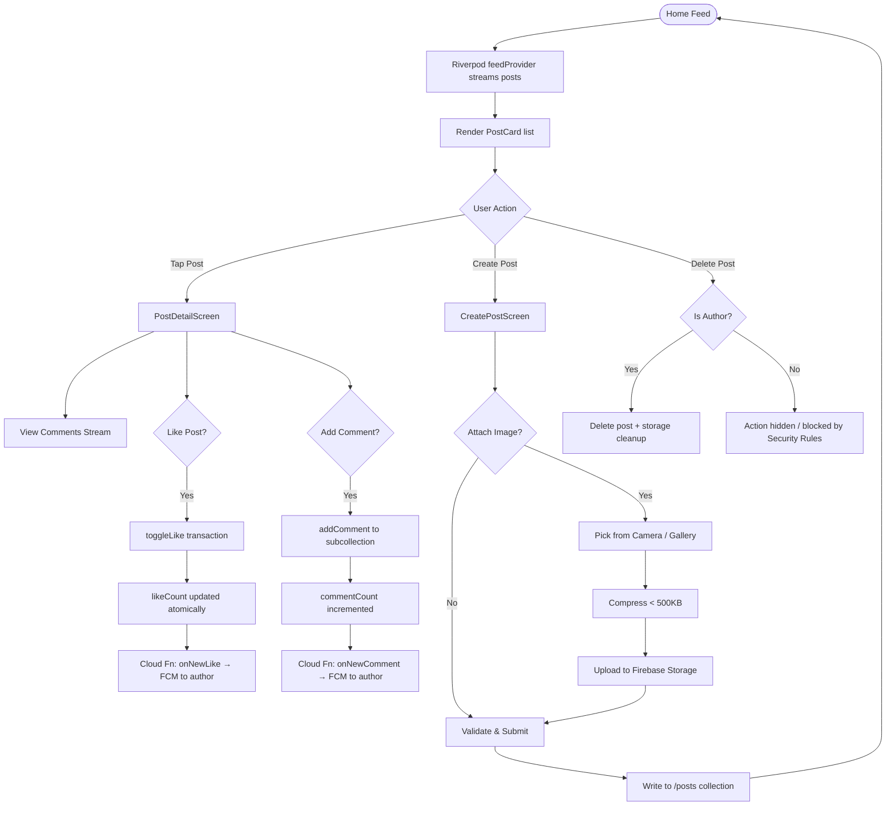
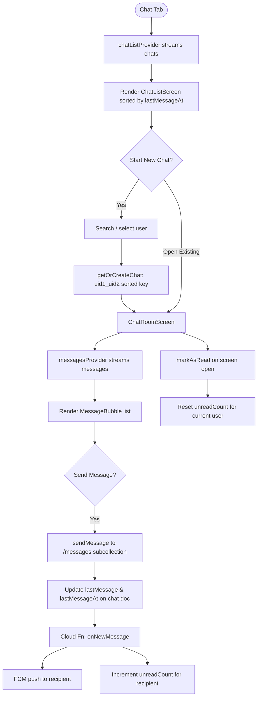

<div align="center">


# ConnectHub

### Social & Community Mobile Application

*Sprint #2 — Flutter & Firebase Project*
*Version 1.0 | March 9, 2026*

[Features](#-features) · [Architecture](#-architecture) · [Project Structure](#-project-structure) · [Getting Started](#-getting-started) · [Data Models](#-data-models) · [Services](#-service-layer) · [State Management](#-state-management) · [Security](#-security) · [Testing](#-testing) · [Team](#-team)

</div>

---

## 📖 Overview

**ConnectHub** is a cross-platform social and community mobile application built with **Flutter** and **Firebase**. It enables users to create profiles, share posts with media, interact through likes and comments, engage in real-time messaging, discover nearby community events via maps, and receive push notifications for relevant activity.

ConnectHub targets **Android** (primary) and **iOS** (secondary) platforms through Flutter's cross-platform framework with a fully serverless Firebase backend.

---

## ✨ Features

| # | Feature | Description |
|---|---------|-------------|
| F1 | **User Authentication** | Email/password sign-up, login, logout with persistent sessions |
| F2 | **User Profiles** | Editable profiles with avatar, bio, and activity stats |
| F3 | **Post Feed** | Create, view, edit, delete posts with text and media attachments |
| F4 | **Social Interactions** | Like, comment, and share posts with real-time counters |
| F5 | **Real-Time Messaging** | One-on-one chat with live sync via Firestore snapshots |
| F6 | **Community Events Map** | Google Maps integration showing events and user locations |
| F7 | **Push Notifications** | FCM-powered alerts for likes, comments, messages, and events |
| F8 | **Media Management** | Image upload, compression, and CDN delivery via Firebase Storage |
| F9 | **Dark Mode & Theming** | Dynamic theme switching with Material 3 color system |
| F10 | **Search & Discovery** | Search users, posts, and community events with filters |

---

## 🏗 Architecture

ConnectHub follows a **three-tier client-serverless architecture** combined with the **MVVM pattern** on the client side.

```
┌─────────────────────────────────────────────────┐
│              CLIENT TIER                        │
│   Flutter Mobile App (Android / iOS)            │
│   Screens │ Widgets │ Navigation │ Riverpod      │
└────────────────────┬────────────────────────────┘
                     │
┌────────────────────▼────────────────────────────┐
│              SERVICE TIER                       │
│           Firebase SDK Layer                    │
│   Auth │ Firestore │ Storage │ FCM │ Functions  │
└────────────────────┬────────────────────────────┘
                     │
┌────────────────────▼────────────────────────────┐
│           EXTERNAL SERVICES                     │
│   Google Maps SDK │ Cloud Functions Runtime     │
└─────────────────────────────────────────────────┘
```

### Technology Stack

| Category | Technology | Purpose |
|----------|------------|---------|
| Language | Dart 3.x | Primary programming language |
| Framework | Flutter 3.x | Cross-platform mobile UI framework |
| Authentication | Firebase Auth | Email/password, session management |
| Database | Cloud Firestore | NoSQL real-time document database |
| File Storage | Firebase Storage | Media files (images, avatars) |
| Serverless | Cloud Functions | Event-driven backend logic (Node.js 18) |
| Notifications | Firebase Cloud Messaging | Push notification delivery |
| Maps | Google Maps SDK | Map rendering, markers, geolocation |
| State Management | Riverpod 2.x | Reactive, testable state management |
| Design | Figma | UI/UX design and prototyping |
| Version Control | Git + GitHub | Source code management |
| CI/CD | GitHub Actions | Automated build, test, and deployment |

---

## 📁 Project Structure

```
connecthub/
├── lib/
│   ├── main.dart              # App entry point, theme config, route setup
│   ├── config/                # Firebase config, constants, theme data
│   ├── models/                # Data model classes (User, Post, Event, etc.)
│   ├── providers/             # Riverpod providers for state management
│   ├── services/              # Firebase service wrappers
│   │   ├── auth_service.dart
│   │   ├── user_service.dart
│   │   ├── post_service.dart
│   │   ├── chat_service.dart
│   │   ├── event_service.dart
│   │   ├── storage_service.dart
│   │   └── notification_service.dart
│   ├── screens/               # Screen-level widgets organized by feature
│   │   ├── auth/              # Login, SignUp, ForgotPassword
│   │   ├── feed/              # FeedScreen, PostDetailScreen, CreatePostScreen
│   │   ├── chat/              # ChatListScreen, ChatRoomScreen
│   │   ├── map/               # MapScreen, EventDetailScreen, CreateEventScreen
│   │   ├── search/            # SearchScreen, SearchResultsScreen
│   │   └── profile/           # MyProfileScreen, EditProfileScreen, SettingsScreen
│   ├── widgets/               # Reusable UI components
│   ├── utils/                 # Helpers, formatters, validators
│   └── routes/                # Route definitions and navigation logic
├── functions/                 # Cloud Functions source (Node.js/TypeScript)
├── test/                      # Unit and widget tests
├── android/                   # Android-specific configuration
├── ios/                       # iOS-specific configuration
├── pubspec.yaml               # Flutter dependencies
└── README.md
```

---

## 🚀 Getting Started

### Prerequisites

- [Flutter SDK](https://flutter.dev/docs/get-started/install) (3.x or higher)
- [Dart SDK](https://dart.dev/get-dart) (3.x or higher)
- [Firebase CLI](https://firebase.google.com/docs/cli)
- [Node.js](https://nodejs.org/) 18+ (for Cloud Functions)
- [Android Studio](https://developer.android.com/studio) or [VS Code](https://code.visualstudio.com/)
- A Google Maps API key

### 1. Clone the Repository

```bash
git clone https://github.com/kalviumcommunity/S64-Mar26-Team01-FFDP.git
cd S64-Mar26-Team01-FFDP
```

### 2. Firebase Setup

1. Create a new Firebase project at [console.firebase.google.com](https://console.firebase.google.com)
2. Enable the following services:
   - Authentication (Email/Password provider)
   - Cloud Firestore
   - Firebase Storage
   - Cloud Messaging (FCM)
   - Cloud Functions
3. Download `google-services.json` (Android) and `GoogleService-Info.plist` (iOS)
4. Place them in the appropriate directories:
   - `android/app/google-services.json`
   - `ios/Runner/GoogleService-Info.plist`

### 3. Configure FlutterFire

```bash
dart pub global activate flutterfire_cli
flutterfire configure
```

### 4. Add Google Maps API Key

**Android** — `android/app/src/main/AndroidManifest.xml`:
```xml
<meta-data
    android:name="com.google.android.geo.API_KEY"
    android:value="YOUR_GOOGLE_MAPS_API_KEY"/>
```

**iOS** — `ios/Runner/AppDelegate.swift`:
```swift
GMSServices.provideAPIKey("YOUR_GOOGLE_MAPS_API_KEY")
```

### 5. Install Dependencies

```bash
flutter pub get
```

### 6. Deploy Firestore Security Rules

```bash
firebase deploy --only firestore:rules
firebase deploy --only storage
```

### 7. Deploy Cloud Functions

```bash
cd functions
npm install
cd ..
firebase deploy --only functions
```

### 8. Run the Application

```bash
# Run on connected device or emulator
flutter run

# Run in release mode
flutter run --release
```

---

## 📦 Dependencies

```yaml
dependencies:
  firebase_core: ^2.x          # Firebase initialization
  firebase_auth: ^4.x          # Authentication
  cloud_firestore: ^4.x        # Firestore database
  firebase_storage: ^11.x      # File storage
  firebase_messaging: ^14.x    # Push notifications
  flutter_riverpod: ^2.x       # State management
  google_maps_flutter: ^2.x    # Google Maps integration
  geolocator: ^10.x            # Location access
  image_picker: ^1.x           # Camera/gallery image selection
  flutter_image_compress: ^2.x # Image compression
  flutter_local_notifications: ^16.x # Foreground notifications
  cached_network_image: ^3.x   # Image caching
  intl: ^0.18.x                # Date/time formatting
  go_router: ^12.x             # Declarative routing
```

---

## 🗃 Data Models

### UserModel

```dart
class UserModel {
  final String uid;
  final String email;
  final String displayName;
  final String avatarUrl;
  final String bio;
  final int postCount;
  final int followerCount;
  final int followingCount;
  final String fcmToken;
  final DateTime createdAt;
  final DateTime lastActive;
}
```

### PostModel

```dart
class PostModel {
  final String postId;
  final String authorUid;
  final String authorName;
  final String authorAvatar;
  final String content;
  final String? imageUrl;
  final int likeCount;
  final int commentCount;
  final DateTime createdAt;
  final DateTime updatedAt;
}
```

### MessageModel

```dart
class MessageModel {
  final String messageId;
  final String senderUid;
  final String text;
  final String type;    // 'text' | 'image'
  final DateTime createdAt;
  final List<String> readBy;
}
```

### EventModel

```dart
class EventModel {
  final String eventId;
  final String creatorUid;
  final String title;
  final String description;
  final GeoPoint location;
  final String address;
  final DateTime dateTime;
  final String? imageUrl;
  final List<String> attendees;
  final DateTime createdAt;
}
```

---

## 🔧 Service Layer

Each service class encapsulates all Firebase interactions for a specific domain and is provided as a singleton via Riverpod.

### AuthService (`lib/services/auth_service.dart`)

| Method | Return Type | Description |
|--------|-------------|-------------|
| `signUp(email, password, name)` | `Future<UserCredential>` | Register new user + create `/users` doc |
| `signIn(email, password)` | `Future<UserCredential>` | Authenticate existing user |
| `signOut()` | `Future<void>` | Sign out + clear local state |
| `resetPassword(email)` | `Future<void>` | Send password reset email |
| `authStateChanges()` | `Stream<User?>` | Stream of auth state for session persistence |
| `updateFcmToken(token)` | `Future<void>` | Store FCM token in user document |

### PostService (`lib/services/post_service.dart`)

| Method | Return Type | Description |
|--------|-------------|-------------|
| `createPost(post, imageFile?)` | `Future<String>` | Create post + optional image upload |
| `getFeedStream(limit)` | `Stream<List<PostModel>>` | Real-time feed ordered by `createdAt` desc |
| `toggleLike(postId, uid)` | `Future<void>` | Like/unlike with Firestore transaction |
| `addComment(postId, comment)` | `Future<void>` | Add comment + increment counter |
| `loadMorePosts(lastDoc, limit)` | `Future<List<PostModel>>` | Pagination with `startAfter` cursor |
| `getUserPosts(uid)` | `Stream<List<PostModel>>` | Posts by a specific user |

### ChatService (`lib/services/chat_service.dart`)

| Method | Return Type | Description |
|--------|-------------|-------------|
| `getOrCreateChat(uid1, uid2)` | `Future<String>` | Get existing or create new chat room |
| `sendMessage(chatId, msg)` | `Future<void>` | Send message + update `lastMessage` |
| `getMessages(chatId)` | `Stream<List<MessageModel>>` | Real-time message stream |
| `getUserChats(uid)` | `Stream<List<ChatModel>>` | All chats sorted by recent |
| `markAsRead(chatId, uid)` | `Future<void>` | Reset unread counter for user |

### EventService (`lib/services/event_service.dart`)

| Method | Return Type | Description |
|--------|-------------|-------------|
| `createEvent(event, imageFile?)` | `Future<String>` | Create event + optional image |
| `getEvents()` | `Stream<List<EventModel>>` | All upcoming events stream |
| `toggleAttendance(eventId, uid)` | `Future<void>` | RSVP toggle |
| `getNearbyEvents(center, radius)` | `Future<List<EventModel>>` | Filter by distance from a point |

---

## 🔄 State Management

ConnectHub uses **Riverpod 2.x** for reactive, testable state management.

| Provider | Type | Purpose |
|----------|------|---------|
| `authProvider` | `StreamProvider<User?>` | Auth state stream for route guards |
| `currentUserProvider` | `StreamProvider<UserModel>` | Current user profile data |
| `feedProvider` | `StreamProvider<List<PostModel>>` | Main feed with real-time updates |
| `postDetailProvider` | `FamilyProvider(postId)` | Individual post with comments |
| `chatListProvider` | `StreamProvider<List<ChatModel>>` | User's chat rooms sorted by recent |
| `messagesProvider` | `FamilyProvider(chatId)` | Messages for a specific chat |
| `eventsProvider` | `StreamProvider<List<EventModel>>` | All community events |
| `themeProvider` | `StateNotifierProvider` | Light/dark mode state |
| `searchProvider` | `StateNotifierProvider` | Search query and results |

### Auth State Flow

```dart
class AuthNotifier extends StateNotifier<AsyncValue<User?>> {
  final AuthService _authService;

  AuthNotifier(this._authService) : super(const AsyncLoading()) {
    _authService.authStateChanges().listen((user) {
      state = AsyncData(user);
    });
  }

  Future<void> signIn(String email, String password) async {
    state = const AsyncLoading();
    try {
      await _authService.signIn(email, password);
    } catch (e) {
      state = AsyncError(e, StackTrace.current);
    }
  }
}
```

---

## 🔀 User Flows

### 1. Onboarding & Authentication


---

### 2. Post Feed & Social Interactions



---

### 3. Real-Time Messaging



---

### 4. Community Events & Map

```mermaid
flowchart TD
    A([Map Tab]) --> B[Request Location Permission]
    B --> C{Permission Granted?}
    C -- No --> D[Show permission dialog]
    D --> B
    C -- Yes --> E[Load Google Maps with user location]
    E --> F[eventsProvider streams /events]
    F --> G[Place custom markers on map]
    G --> H{User Action}
    H -- Tap Marker --> I[Event Info Bottom Sheet]
    I --> J{RSVP?}
    J -- Yes --> K[toggleAttendance: add uid to attendees]
    K --> L[Update Firestore /events doc]
    J -- No --> I
    H -- Create Event --> M[CreateEventScreen]
    M --> N[Fill title / description / dateTime]
    N --> O[Pick location on map]
    O --> P{Attach Banner Image?}
    P -- Yes --> Q[Upload to /events/{eventId} in Storage]
    P -- No --> R[Save GeoPoint + all fields to Firestore]
    Q --> R
    R --> S[Cloud Fn: onNewEvent → notify nearby users]
    S --> E
```

---

### 5. User Profile & Search


---

### 6. Push Notification Flow

```mermaid
flowchart TD
    A([App Start]) --> B[NotificationService.initialize]
    B --> C[Get FCM device token]
    C --> D[Store token in /users/{uid}.fcmToken]
    D --> E{App State}
    E -- Foreground --> F[flutter_local_notifications shows banner]
    E -- Background / Killed --> G[FCM delivers system notification]
    F --> H{User taps notification?}
    G --> H
    H -- like / comment --> I[Navigate to PostDetailScreen]
    H -- message --> J[Navigate to ChatRoomScreen]
    H -- event --> K[Navigate to EventDetailScreen]
```

---

## 📱 Navigation Structure

The app uses a `BottomNavigationBar` with **5 main tabs**, each with its own Navigator stack for independent navigation history.

| # | Tab | Root Screen | Child Screens |
|---|-----|-------------|---------------|
| 1 | 🏠 Home | `FeedScreen` | `PostDetailScreen`, `CreatePostScreen`, `UserProfileScreen` |
| 2 | 🔍 Search | `SearchScreen` | `SearchResultsScreen`, `UserProfileScreen` |
| 3 | 🗺 Map | `MapScreen` | `EventDetailScreen`, `CreateEventScreen` |
| 4 | 💬 Chat | `ChatListScreen` | `ChatRoomScreen` |
| 5 | 👤 Profile | `MyProfileScreen` | `EditProfileScreen`, `SettingsScreen` |

---

## 🗄 Firestore Database Schema

### `/users` Collection
```
users/{uid}
├── email         : String
├── displayName   : String
├── avatarUrl     : String
├── bio           : String (max 160 chars)
├── postCount     : Number
├── followerCount : Number
├── followingCount: Number
├── fcmToken      : String
├── createdAt     : Timestamp
└── lastActive    : Timestamp
```

### `/posts` Collection
```
posts/{postId}
├── authorUid     : String
├── authorName    : String  (denormalized)
├── authorAvatar  : String  (denormalized)
├── content       : String
├── imageUrl      : String?
├── likeCount     : Number
├── commentCount  : Number
├── createdAt     : Timestamp
├── updatedAt     : Timestamp
├── comments/{commentId}
│   ├── authorUid : String
│   ├── authorName: String
│   ├── text      : String
│   └── createdAt : Timestamp
└── likes/{uid}
    └── createdAt : Timestamp
```

### `/chats` Collection
```
chats/{chatId}           <- chatId = sorted "uid1_uid2"
├── participants   : Array<String>
├── lastMessage    : String
├── lastMessageAt  : Timestamp
├── unreadCount    : Map<String, Number>
└── messages/{messageId}
    ├── senderUid  : String
    ├── text       : String
    ├── type       : String ('text' | 'image')
    ├── createdAt  : Timestamp
    └── readBy     : Array<String>
```

### `/events` Collection
```
events/{eventId}
├── creatorUid    : String
├── title         : String
├── description   : String
├── location      : GeoPoint
├── address       : String
├── dateTime      : Timestamp
├── imageUrl      : String?
├── attendees     : Array<String>
└── createdAt     : Timestamp
```

### Firebase Storage Structure

| Path | Purpose |
|------|---------|
| `/avatars/{uid}/profile.jpg` | User profile images |
| `/posts/{postId}/{filename}` | Post image attachments |
| `/events/{eventId}/{filename}` | Event banner images |
| `/chat_media/{chatId}/{filename}` | Chat shared images |

---

## ☁️ Cloud Functions

Runtime: **Node.js 18 (TypeScript)**

| Function | Trigger | Description |
|----------|---------|-------------|
| `onNewLike` | Firestore `onCreate` | Sends push notification to post author on new like |
| `onNewComment` | Firestore `onCreate` | Sends push notification to post author on new comment |
| `onNewMessage` | Firestore `onCreate` | Sends push to recipient, updates `unreadCount` |
| `onUserDelete` | Auth `onDelete` | Cleans up user data: posts, chats, event attendee lists |
| `onNewEvent` | Firestore `onCreate` | Notifies nearby users via FCM |
| `cleanupExpiredEvents` | Scheduled (daily) | Deletes events with past `dateTime` |

---

## 🔐 Security

### Firestore Security Rules

| Collection | Read | Write |
|------------|------|-------|
| `/users/{uid}` | Any authenticated user | Document owner only |
| `/posts/{postId}` | Any authenticated user | Create: authenticated; Update/Delete: author only |
| `/posts/{id}/comments` | Any authenticated user | Create: authenticated; Delete: comment author |
| `/chats/{chatId}` | Participants only | Participants only |
| `/events/{eventId}` | Any authenticated user | Create: authenticated; Update/Delete: creator |

### Firebase Storage Security Rules

- **Avatars**: Max 5 MB, `image/*` type only, owner-write restricted
- **Post images**: Max 10 MB, `image/*` type only, any authenticated user
- **Event images**: Max 10 MB, `image/*` type only, any authenticated user
- **Chat media**: Max 10 MB, any authenticated user

---

## 🛡 Error Handling

| Error Type | Handling | User Experience |
|------------|----------|-----------------|
| Network Error | Catch `SocketException` | `ErrorRetryWidget` with offline indicator |
| Auth Error | Map `FirebaseAuthException` codes | Specific messages (e.g., "Wrong password") |
| Firestore Error | Catch `FirebaseException` | SnackBar with error + retry option |
| Permission Error | Catch `PlatformException` | Dialog explaining why permission is needed |
| Image Upload Error | Retry with exponential backoff | Progress indicator + failure message |
| Empty State | Check list length == 0 | `EmptyStateWidget` with helpful message |
| Loading State | `AsyncValue.loading` | Shimmer placeholder or circular indicator |

---

## 🧩 Reusable Widgets

| Widget | Props | Description |
|--------|-------|-------------|
| `PostCard` | `PostModel, onLike, onComment, onTap` | Feed item card with all post interactions |
| `UserAvatar` | `String url, double size, VoidCallback? onTap` | Circular avatar with fallback initials |
| `MessageBubble` | `MessageModel, bool isMine` | Chat bubble with timestamp |
| `EventCard` | `EventModel, VoidCallback onTap` | Event summary card for lists |
| `CustomTextField` | `controller, label, validator, obscure` | Styled text input with validation |
| `PrimaryButton` | `String text, VoidCallback onPressed, bool loading` | Themed action button with loading spinner |
| `EmptyStateWidget` | `String icon, String message` | Placeholder for empty lists |
| `LoadingOverlay` | `bool isLoading, Widget child` | Full-screen loading indicator overlay |
| `ErrorRetryWidget` | `String message, VoidCallback onRetry` | Error display with retry button |

---

## 🧪 Testing

### Unit Tests
- Data model serialization/deserialization (`fromFirestore`, `toMap`)
- Service method logic with mocked Firebase instances
- Provider state transitions and error handling
- Validator functions (email, password, post content)

### Widget Tests
- `PostCard` renders correctly with sample data
- Form validation displays error messages
- Navigation triggers on button taps
- Empty state and loading state rendering

### Integration Tests
- Full auth flow: sign-up → login → logout
- Post CRUD: create, read, update, delete
- Chat: send message, receive message
- Event: create, RSVP, view on map

```bash
# Run unit and widget tests
flutter test

# Run integration tests
flutter test integration_test/
```

---

## 📊 Non-Functional Requirements

| Category | Requirement |
|----------|-------------|
| **Cold Start** | < 3 seconds on mid-range devices |
| **Feed Load** | < 1.5 seconds for initial 20 posts |
| **Messaging Latency** | < 500ms end-to-end |
| **Image Upload** | Compressed to < 500KB before upload |
| **Uptime** | 99.95% (Firebase SLA) |
| **Offline Mode** | Firestore cached data accessible without network |
| **Scalability** | Firestore + Cloud Functions auto-scale serverlessly |

---

## 🔁 CI/CD Pipeline

```
Push / PR to main
       │
       ▼
GitHub Actions
   ├── flutter analyze   (lint & static analysis)
   ├── flutter test      (unit + widget tests)
   └── flutter build apk (APK artifact)
```

**Deployment:**
- Staging Firebase project for pre-production testing
- Release builds: APK and App Bundle generation
- Play Store deployment via Fastlane or manual upload

---

## 📄 License

This project was developed as part of **Kalvium Sprint #2**. All rights reserved by the ConnectHub team.

---

<div align="center">

Made with ❤️ by Team ConnectHub — Sprint #2, March 2026

</div>
