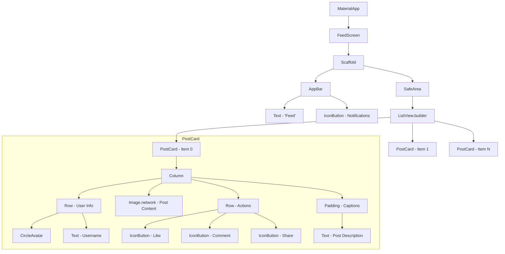

# FeedScreen Widget Tree Diagram

This diagram visualizes the architecture of the `FeedScreen`, showing how components are nested to form the complete UI.

## Widget Tree (Mermaid.js)

## Architectural Breakdown

### 1. The Foundation: `Scaffold`
The `Scaffold` provides the basic visual structure, ensuring standard Material Design elements like the `AppBar` and the body area are correctly positioned.

### 2. The Scrolling Mechanism: `ListView.builder`
We use `ListView.builder` for efficiency. Instead of building all posts at once, it lazily builds `PostCard` widgets only as they come into view, maintaining smooth 60fps scrolling even with thousands of entries.

### 3. Component Reusability: `PostCard`
The `PostCard` is a custom widget encapsulates the logic and layout for a single post. This modularity makes the code easier to maintain and test in isolation.

### 4. Layout Widgets: `Column`, `Row`, `Padding`
These non-visual widgets are the skeleton of the UI, handle the positioning and spacing of visual elements like `Text`, `Image`, and `Icon`.
