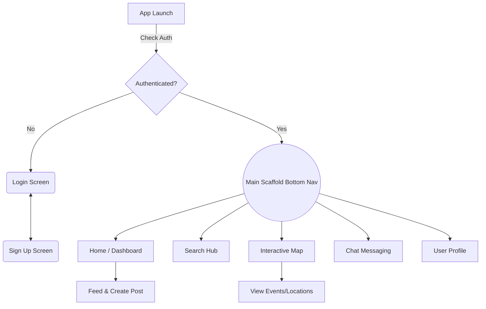

# NanheNest User Flow

This document outlines the user navigation and application flow within the NanheNest app, driven by its current `go_router` implementation (`lib/config/router.dart`).

## 1. Authentication & Onboarding Flow
The application has a top-level redirect gatekeeper that listens to Firebase Authentication state.
* **Launch:** When a user opens the app, the router checks for `FirebaseAuth.instance.currentUser`.
* **Unauthenticated:** 
  * Redirected to `/login` (`LoginScreen`).
  * From `/login`, the user can toggle to `/signup` (`SignUpScreen`) to create a new account, and vice versa.
* **Authenticated:**
  * Automatically redirected securely into the Main Application Shell at `/`.

## 2. Main Application Flow (Bottom Navigation Shell)
Once authenticated, the app utilizes a `StatefulShellRoute.indexedStack`. This wraps the application in a `MainScaffold` with persistent bottom navigation tabs, maintaining state across the different branches. 

Users can seamlessly navigate between five main hubs:

### 🏠 Home Branch (`/`)
* **Screen:** `DashboardScreen`
* **Flow:** The default landing page post-login. Here, users can view a real-time feed of posts. They can also create their own posts, view likes/comments, and access top-level controls (like logging out or viewing secondary demos like animations).

### 🔍 Search Branch (`/search`)
* **Screen:** `SearchScreen`
* **Flow:** Allows users to query the database. Depending on the feature set, this allows users to look up other users (`UserModel`), posts (`PostModel`), or events (`BookingModel`).

### 🗺️ Map Branch (`/map`)
* **Screen:** `MapScreen`
* **Flow:** Renders the Google Maps integration. Users can navigate the geographical map, view event markers, and interact with location-based data (fetching data from the `LocationModel` and `BookingModel`).

### 💬 Chat Branch (`/chat`)
* **Screen:** `ChatScreen`
* **Flow:** The messaging hub. Users can access their individual conversations mapped against the `MessageModel` and communicate with other users in real-time. *(Note: as identified in the schema analysis, firestore rules for this collection need updating for it to function correctly).*

### 👤 Profile Branch (`/profile`)
* **Screen:** `ProfileScreen`
* **Flow:** Allows the user to view their personal identity within the app. They can view their `avatarUrl`, `bio`, followers/following count, and access controls to edit their profile information.

## Diagram summary

